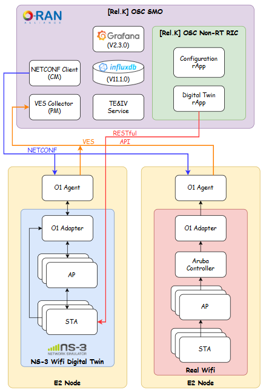
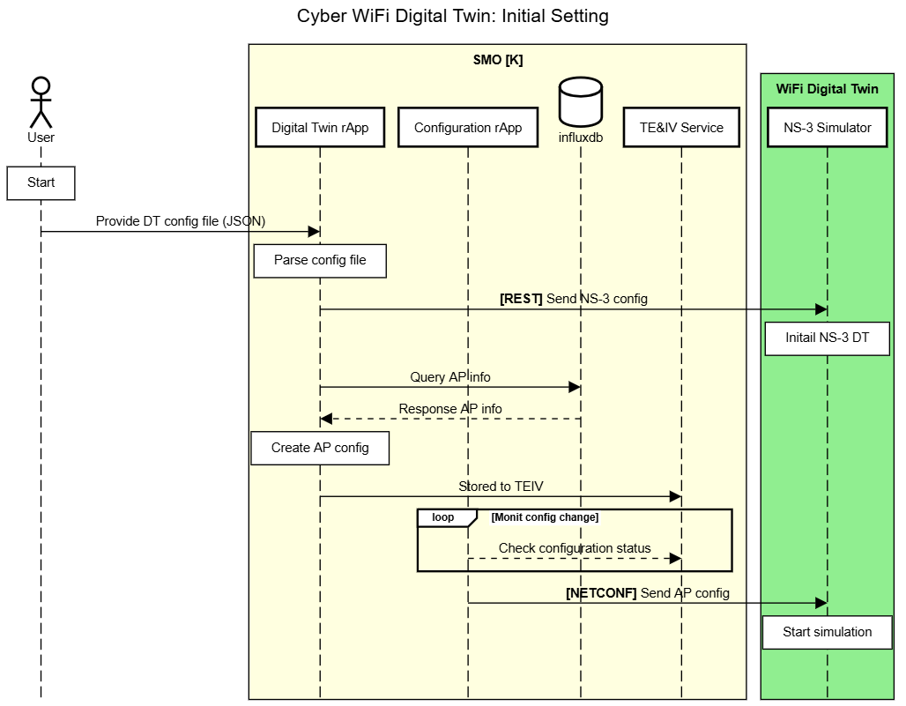
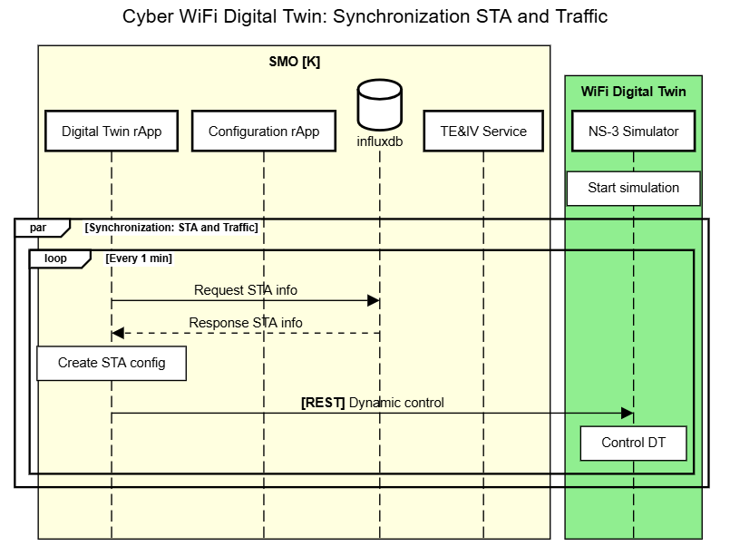
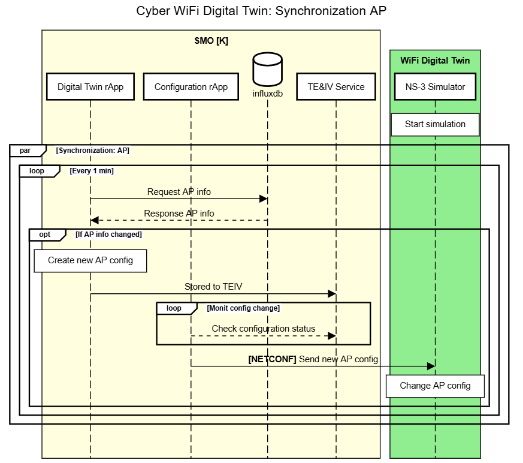

# NS-3 WiFi Digital Twin

## Purpose
This document provides a comprehensive overview of the NS-3 WiFi Digital Twin system, its architecture, and how they interact. The WiFi Digital Twin is a simulation environment built on NS-3 that implements O-RAN compliant interfaces for configuration management and monitoring, allowing it to be integrated with Service Management Orchestration (SMO) systems.

## System Architecture


## Message Sequence Chart
Notes on the current MCS module progress:
So far, only partial functionality has been implemented.

### Inintial Setting


### Synchronization STA and Traffic


### Synchronization AP


## Folder Structure
```plaintext
ns3_wifi_dt/
├── doc/                        # Project documentation
├── sandbox/                    # Experimental or temporary code for testing
├── src/
│   ├── build                   # Files for building environment
│   ├── config_dt               # Configuration file example for ns-3 DT
│   ├── ns3_sim_files           # wifi DT ns-3 code
│   └── rapp                    # rapp for configuration wifi DT
└── README.md
```