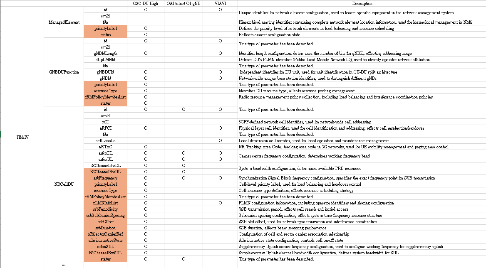
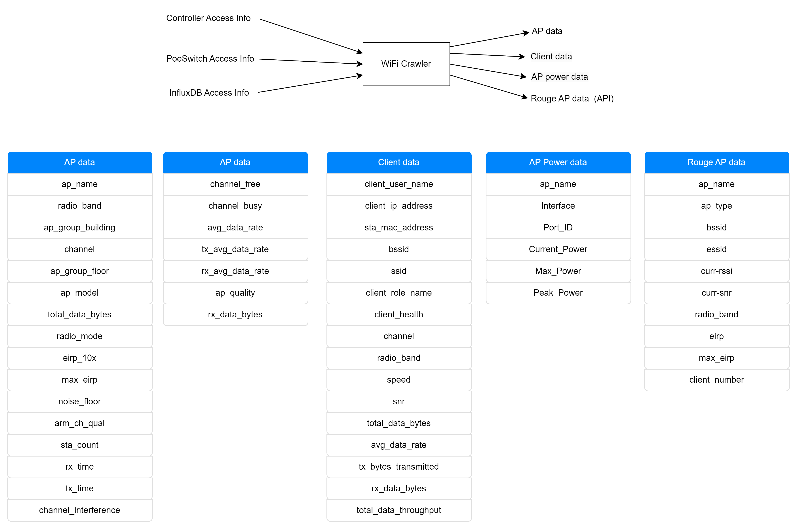

# Parameters Mapping

- [Parameters Mapping](#parameters-mapping)
  - [Mapping parameters](#mapping-parameters)
    - [My Wifi config parameters](#my-wifi-config-parameters)
    - [Mapping Table](#mapping-table)
    - [Compair with ES \& ML parameters](#compair-with-es--ml-parameters)
    - [Config File After Mapping](#config-file-after-mapping)
      - [Configuration File Example](#configuration-file-example)
  - [Mapping Idea](#mapping-idea)
    - [**Mapping WiFi Parameters to 3GPP 5G NR Parameters**](#mapping-wifi-parameters-to-3gpp-5g-nr-parameters)
    - [**Mapping WiFi AP to 3GPP 5G NR Parameters**](#mapping-wifi-ap-to-3gpp-5g-nr-parameters)
  - [Appendix](#appendix)
    - [Parameters related to ```<ManagedElement>```](#parameters-related-to-managedelement)
      - [`Top_Grp`](#top_grp)
      - [`ManagedElement_Grp`](#managedelement_grp)
      - [`ManagedElementGrp`](#managedelementgrp)
    - [Parameters related to ```<GNBDUFunction>```](#parameters-related-to-gnbdufunction)
      - [`Top_Grp`](#top_grp-1)
      - [`ManagedFunctionGrp`](#managedfunctiongrp)
      - [`GNBDUFunctionGrp`](#gnbdufunctiongrp)
    - [Parameters related to ```<NRCellDU>```](#parameters-related-to-nrcelldu)
      - [`Top_Grp`](#top_grp-2)
      - [`ManagedFunctionGrp`](#managedfunctiongrp-1)
      - [`NRCellDUGrp`](#nrcelldugrp)
      - [`RRMPolicy_Grp`](#rrmpolicy_grp)
      - [`rRMPolicyMemberGrp`](#rrmpolicymembergrp)
    - [Parameters used by Jerry](#parameters-used-by-jerry)
    - [Parameters from Aruba Web Crawling(by Tori)](#parameters-from-aruba-web-crawlingby-tori)
      - [Details of Aruba AP Parameter](#details-of-aruba-ap-parameter)
      - [Details of Aruba Client Parameter](#details-of-aruba-client-parameter)


## Mapping parameters
### My Wifi config parameters


| Parameters     | Data Types  | description                                                                  |
|:-------------- |:----------- |:---------------------------------------------------------------------------- |
| AP ID          | `uint32`    | The configured id of the WiFi Access Point.                                                                             |
| AP name        | `string`    | The configured name of the WiFi Access Point. (RB_1F_AP01)                   |
| SSID           | `string`    | The network name that identifies the WiFi network.                           |
| Radio band     | `string`    | AP frequency band, 2.4GHz, 5GHz.                                             |
| Channel number | `uint32`    | The frequency channel on which the AP operates (e.g., 1, 6, 11 for 2.4GHz).  |
| Position.X     | `decimal64` | The physical coordinates of the AP in a 3D space, representing its location. |
| Position.Y     | `decimal64` | The physical coordinates of the AP in a 3D space, representing its location. |
| Position.Z     | `decimal64` | The physical coordinates of the AP in a 3D space, representing its location. |


### Mapping Table 

| Aruba        | ns-3         | O1              |
|:------------ |:------------ |:--------------- |
| `ap_id`      | `ap_id`      | `gNBDUId`       |
| `ap_name`    | `ap_name`    | `gNBDUName`     |
| `ssid`       | `SSID`       | `id`            |
| `radio_band` | `radio_band` | X               |
| `channel`    | `channel`    | `arfcnDL`       |
| X            | `Position.X` | `siteLatitude`  |
| X            | `Position.Y` | `siteLongitude` |
| X            | `Position.Z` | `siteAltitude`  |

We do not map the radio_band parameter, as the frequency band can be determined based on the value of the channel number.

### Compair with ES & ML parameters

| Description                                                                                    | Target Entity | [3GPP TS 28.552 v17.6.0](https://portal.3gpp.org/desktopmodules/Specifications/SpecificationDetails.aspx?specificationId=3413) index | 3GPP         | [VIAVI](https://drive.google.com/file/d/1-1XJGd6pl0W2EnxBbraI_mbzAObB0C1n/view?usp=sharing) | ns-3       |
| ---------------------------------------------------------------------------------------------- | ------------- | ------------------------------------------------------------------------------------------------------------------------------------ | ------------ | ------------------------------------------------------------------------------------------- | ---------- |
| Average downlink throughput (in Gbp)                                                           | Cell, UE, QoS | 5.1.1.3.1                                                                                                                            | DRB_UEThpDl  |                                                                                             | throughput |
| Average power consumed over the measurement period (in watts, W)                               | Cell          | 5.1.1.19.2.1                                                                                                                         | PEE.AvgPower |                                                                                             | (TBD.)     |
| Total usage (in percentage) of Physical Resource Blocks (PRBs) on the downlink for any purpose | Cell, mMIMO   | 5.1.1.2.1                                                                                                                            | RRU_PrbTotDl |                                                                                             | (TBD.)     |
| Cell's or UE serving cell's "localCellId"                                                      | UE            |                                                                                                                                      | -            | Viavi_Cell_id                                                                               | ap_id      |


### Config File After Mapping

Since the YANG models defined by 3GPP have specific structures and constraints, the configuration file must comply with these YANG specifications—for example, by including certain mandatory parameters. Therefore, the final configuration file will be based on the mapped WiFi parameters, supplemented with the required fields and formats as defined in the YANG model.

#### Configuration File Example
```xml=
<ManagedElement xmlns="urn:3gpp:sa5:_3gpp-common-managed-element">
  <id>ntust-wifi-dt-ap-0007</id>
  <attributes>
    <priorityLabel>1</priorityLabel>
  </attributes>
  <GNBDUFunction xmlns="urn:3gpp:sa5:_3gpp-nr-nrm-gnbdufunction">
    <id>ntust-peap,AP-1,band=3</id>
    <attributes>
      <priorityLabel>1</priorityLabel>
      <gNBId>0</gNBId>
      <gNBIdLength>32</gNBIdLength>
      <gNBDUId>1</gNBDUId>
      <gNBDUName>RB_1F_AP01</gNBDUName>
      <peeParametersList>
        <idx>1</idx>
        <siteLatitude>0.0</siteLatitude>
        <siteLongitude>0.0</siteLongitude>
        <siteAltitude>0.0</siteAltitude>
      </peeParametersList> 
    </attributes>
    <NRCellDU xmlns="urn:3gpp:sa5:_3gpp-nr-nrm-nrcelldu">
      <id>ntust-peap,AP-1,2.4G</id>
      <attributes>
        <priorityLabel>1</priorityLabel>
        <arfcnDL>1</arfcnDL>
      </attributes>
    </NRCellDU>
    <NRCellDU xmlns="urn:3gpp:sa5:_3gpp-nr-nrm-nrcelldu">
      <id>ntust-peap,AP-1,5G</id>
      <attributes>
        <priorityLabel>1</priorityLabel>
        <arfcnDL>36</arfcnDL>
      </attributes>
    </NRCellDU>
  </GNBDUFunction>
  <GNBDUFunction xmlns="urn:3gpp:sa5:_3gpp-nr-nrm-gnbdufunction">
    <id>ntust-peap,AP-2,band=1</id>
    <attributes>
      <priorityLabel>1</priorityLabel>
      <gNBId>0</gNBId>
      <gNBIdLength>32</gNBIdLength>
      <gNBDUId>2</gNBDUId>
      <gNBDUName>RB_1F_AP02</gNBDUName>
      <peeParametersList>
        <idx>2</idx>
        <siteLatitude>50.0</siteLatitude>
        <siteLongitude>0.0</siteLongitude>
        <siteAltitude>0.0</siteAltitude>
      </peeParametersList> 
    </attributes>
    <NRCellDU xmlns="urn:3gpp:sa5:_3gpp-nr-nrm-nrcelldu">
      <id>ntust-peap,AP-2,2.4G</id>
      <attributes>
        <priorityLabel>1</priorityLabel>
        <arfcnDL>2</arfcnDL>
      </attributes>
    </NRCellDU>
  </GNBDUFunction>
</ManagedElement>
```


## Mapping Idea
### **Mapping WiFi Parameters to 3GPP 5G NR Parameters**

In the context of **3GPP 5G NR architecture**, the functions of a **WiFi Access Point (AP)** closely resemble those of a **Distributed Unit (DU)** in a 5G network. This similarity can be observed in the following ways:

1. **Wireless Signal Transmission & Data Processing**
   - A **WiFi AP** is responsible for handling **wireless communication**, including **radio signal transmission, modulation, and data processing**.
   - Similarly, a **5G NR DU**, as defined by **3GPP specifications**, manages **PHY (Physical Layer), MAC (Medium Access Control), and RLC (Radio Link Control) processing**, ensuring efficient communication between the user equipment (UE) and the network.
2. **User Device (UE) Connection Management**
   - A **WiFi AP** directly manages connections with user devices, **allocating channels, handling authentication, and maintaining wireless links**.
   - A **5G NR DU** also directly interacts with **UEs (User Equipment)**, maintaining radio connections and supporting **handover operations**, in accordance with 3GPP-defined procedures.
3. **Traffic Forwarding to Higher Layers**
   - A **WiFi AP** forwards user traffic to the **upper-layer network (such as a router, gateway, or cloud service)**.
   - A **5G NR DU** similarly **transmits data packets to the Central Unit (CU)**, which is responsible for higher-layer protocol handling and communication with the 5G core network.

Given these similarities, a **WiFi AP** in a traditional wireless network can be considered functionally **equivalent to a 5G DU** as defined in **3GPP 5G NR specifications**. Therefore, when mapping **WiFi parameters to 5G system components**, it is most appropriate to refer to the **3GPP-defined DU and NRCellDU models**.

### **Mapping WiFi AP to 3GPP 5G NR Parameters**

According to **3GPP 5G NR specifications**, the **Distributed Unit (DU) is divided into two key components**:

1. **`gNBDUFunction` (gNB DU Function)**
   - Represents the **DU as a functional entity** within the overall **gNB (gNodeB) architecture**.
   - Responsible for **radio resource management, traffic forwarding, and lower-layer protocol handling**.

2. **`NRCellDU` (NR Cell in DU)**
   - Represents the **individual NR cell (radio coverage area) within a DU**.
   - Defines **frequency configurations, bandwidth allocation, and operational parameters** for a specific coverage area.

Since **each WiFi AP operates independently** and is managed by a **WiFi controller**, the most appropriate mapping is:

- **Each WiFi AP corresponds to one `gNBDUFunction` (DU).**
- **Each WiFi AP covers a specific area, which corresponds to one `NRCellDU`.**
- **A single WiFi AP may have two `NRCellDU`, as it may support both 2.4GHz and 5GHz frequency bands.**

This mapping ensures that **WiFi network parameters can be aligned with O-RAN and 3GPP-defined 5G NR parameters**.


## Appendix

The following YANG parameter tables are taken from VIAVI.
❌: read-only, can not be changed
✅: Mandatory in the list if the list is used

### Parameters related to ```<ManagedElement>```
The file where the parameter is located: `_3gpp-common-managed-element.yang`, `_3gpp-common-top.yang`

#### `Top_Grp`
| Parameter Name | Type     | Description                                  | Remarks                  |
|:-------------- |:-------- |:-------------------------------------------- |:------------------------ |
| `id`           | `string` | Key leaf (namingAttribute) for a class/list. | `key` `_3gpp-common-top` |

#### `ManagedElement_Grp`
| Parameter Name              | Type                          | Description                                                       | Remarks      |
|:--------------------------- |:----------------------------- |:----------------------------------------------------------------- |:------------ |
| `dnPrefix`                  | `types3gpp:DistinguishedName` | Naming context for partitioning Managed Elements.                 | `attributes` |
| `userLabel`                 | `string`                      | User-friendly, customizable name.                                 | `attributes` |
| `locationName` ❌           | `string`                      | Physical location of the entity. (read-only)                      | `attributes` |
| `managedBy` ❌              | `types3gpp:DistinguishedName` | List of related ManagementSystem instances (DNs). (read-only)     | `attributes` |
| `managedElementTypeList` ❌ | `string`                      | Functionality type(s) provided by the ManagedElement. (read-only) | `attributes` |


#### `ManagedElementGrp`
| Parameter Name     | Type     | Description                            | Remarks      |
|:------------------ |:-------- |:-------------------------------------- |:------------ |
| `vendorName` ❌    | `string` | Vendor name (read-only).               | `attributes` |
| `userDefinedState` | `string` | Operator-defined state for custom use. | `attributes` |
| `swVersion` ❌     | `string` | Software version (read-only).          | `attributes` |
| `priorityLabel`    | `uint32` | Priority label (mandatory, uint32).    | `attributes` |


### Parameters related to ```<GNBDUFunction>```
The file where the parameter is located: `_3gpp-nr-nrm-gnbdufunction.yang`, `_3gpp-common-managed-function.yang`, `_3gpp-common-top.yang`

#### `Top_Grp`
| Parameter Name | Type     | Description                                  | Remarks                  |
|:-------------- |:-------- |:-------------------------------------------- |:------------------------ |
| `id`           | `string` | Key leaf (namingAttribute) for a class/list. | `key` `_3gpp-common-top` |


#### `ManagedFunctionGrp`
| Parameter Name          | Type           | Description                           | Remarks                          |
|:----------------------- |:-------------- |:------------------------------------- |:-------------------------------- |
| `userLabel`             | `string`       | User-defined name.                    | `attributes` `vnfParametersList` |
| `vnfInstanceId`         | `string`       | VNF instance ID.                      | `attributes` `vnfParametersList` |
| `vnfdId`                | `string`       | VNFD identifier for the VNF instance. | `attributes` `vnfParametersList` |
| `flavourId`             | `string`       | VNF deployment flavor ID.             | `attributes` `vnfParametersList` |
| `autoScalable` ✅       | `boolean`      | Indicates if auto-scaling is enabled. | `attributes` `vnfParametersList` |
| `idx`                   | `uint32`       | Index key of `peeParametersList`.     | `attributes` `peeParametersList` |
| `siteIdentification` ✅ | `string`       | Site identifier.                      | `attributes` `peeParametersList` |
| `siteLatitude`          | `decimal64(4)` | Site latitude (WGS 84).               | `attributes` `peeParametersList` |
| `siteLongitude`         | `decimal64(4)` | Site longitude (WGS 84).              | `attributes` `peeParametersList` |
| `siteAltitude`          | `decimal64(4)` | Site altitude (meters).               | `attributes` `peeParametersList` |
| `siteDescription` ✅    | `string`       | Site description.                     | `attributes` `peeParametersList` |
| `equipmentType` ✅      | `string`       | Equipment type.                       | `attributes` `peeParametersList` |
| `environmentType` ✅    | `string`       | Environment type.                     | `attributes` `peeParametersList` |
| `powerInterface` ✅     | `string`       | Power interface type.                 | `attributes` `peeParametersList` |
| `priorityLabel` ✅      | `uint32`       | Priority label.                       | `attributes` `peeParametersList` |


#### `GNBDUFunctionGrp`
| Parameter Name       | Type     | Description                                                           | Remarks      |
|:-------------------- |:-------- |:--------------------------------------------------------------------- |:------------ |
| `gNBId` ✅           | `int64`  | Identifies a gNB within a PLMN, part of the NR Cell Identifier (NCI). | `attributes` |
| `gNBIdLength` ✅     | `int32`  | Number of bits used to encode the gNB ID.                             | `attributes` |
| `gNBDUId` ✅         | `int64`  | Uniquely identifies the Distributed Unit (DU) within a gNB.           | `attributes` |
| `gNBDUName`          | `string` | Name of the Distributed Unit (DU) in an NR node.                      | `attributes` |
| `rimRSReportConf` ❌ | `list`   | Configures gNBs to report RIM-RS information to OAM.                  | `attributes` |


### Parameters related to ```<NRCellDU>```
The file where the parameter is located: `_3gpp-nr-nrm-nrcelldu.yang`, `_3gpp-common-top.yang`, `_3gpp-common-managed-function.yang`


#### `Top_Grp`
| Parameter Name | Type     | Description                                  | Remarks                  |
|:-------------- |:-------- |:-------------------------------------------- |:------------------------ |
| `id`           | `string` | Key leaf (namingAttribute) for a class/list. | `key` `_3gpp-common-top` |


#### [`ManagedFunctionGrp`](#ManagedFunctionGrp)


#### `NRCellDUGrp`
| Parameter Name                             | Type                                | Description                                                                     | Remarks                  |
|:------------------------------------------ |:----------------------------------- |:------------------------------------------------------------------------------- |:------------------------ |
| `cellLocalId` ✅                           | `int32`                             | Identifies an NR cell within a gNB.                                             | `attributes`             |
| `operationalState` ❌                      | `types3gpp:OperationalState`        | Indicates if the NRCellDU is operational (ENABLED/DISABLED).                    | `attributes`             |
| `administrativeState`                      | `types3gpp:AdministrativeState`     | Defines OAM-controlled cell usage permission.                                   | `attributes`             |
| `cellState` ❌                             | `types3gpp:CellState`               | Indicates whether the cell is IDLE, INACTIVE, or ACTIVE.                        | `attributes`             |
| `pLMNInfoList`                             | uses `types5g3gpp:PLMNInfo`         | Defines PLMNs served by the NR cell and supported S-NSSAIs for network slicing. | `attributes`  `list`     |
| `nPNIdentityList`                          | uses `NPNIdentityGrp`               | Defines NPNs served by the NR cell, including supported CAG IDs or NIDs.        | `attributes`  `list`     |
| `nRPCI` ✅                                 | `int32`                             | Physical Cell Identity (PCI) of the NR cell.                                    | `attributes`             |
| `nRTAC`                                    | `types3gpp:Tac`                     | 5GS Tracking Area Code for PLMNs.                                               | `attributes`             |
| `arfcnDL` ✅                               | `int32`                             | Downlink NR Absolute Radio Frequency Channel Number (NR-ARFCN).                 | `attributes`             |
| `arfcnUL`                                  | `int32`                             | Uplink NR-ARFCN.                                                                | `attributes`             |
| `arfcnSUL`                                 | `int32`                             | Supplementary uplink NR-ARFCN.                                                  | `attributes`             |
| `bSChannelBwDL`                            | `int32 (MHz)`                       | Downlink channel bandwidth.                                                     | `attributes`             |
| `rimRSMonitoringStartTime` ✅              | `yang:date-and-time`                | Start time for RIM-RS monitoring.                                               | `attributes`             |
| `rimRSMonitoringStopTime` ✅               | `yang:date-and-time`                | Stop time for RIM-RS monitoring.                                                | `attributes`             |
| `rimRSMonitoringWindowDuration` ✅         | `uint32`                            | Duration of RIM-RS monitoring window.                                           | `attributes`             |
| `rimRSMonitoringWindowStartingOffset` ✅   | `uint8(hours)`                      | Start offset of the first monitoring window within a day.                       | `attributes`             |
| `rimRSMonitoringWindowPeriodicity` ✅      | `uint8 (1,2,3,4,6,8,12,24) (hours)` | Periodicity of the monitoring window.                                           | `attributes`             |
| `rimRSMonitoringOccasionInterval`  ✅      | `uint32`                            | Interval between adjacent monitoring occasions.                                 | `attributes`             |
| `rimRSMonitoringOccasionStartingOffset` ✅ | `uint32`                            | Start offset of the first monitoring occasion in a window.                      | `attributes`             |
| `ssbFrequency` ✅                          | `int32`                             | SSB frequency domain position (NR-ARFCN).                                       | `attributes`             |
| `ssbPeriodicity` ✅                        | `int32 (5,10,20,40,80,160) (ms)`    | SSB periodicity for rate matching.                                              | `attributes`             |
| `ssbSubCarrierSpacing` ✅                  | `int32 (15,30,120,240) (kHz)`       | SSB subcarrier spacing.                                                         | `attributes`             |
| `ssbOffset` ✅                             | `int32 (0..159) (ms)`               | Time domain position of SSB.                                                    | `attributes`             |
| `ssbDuration`  ✅                          | `int32 (1..5) (ms)`                 | Measurement window duration for SS/PBCH blocks.                                 | `attributes`             |
| `bSChannelBwUL`                            | `int32 (MHz)`                       | Uplink channel bandwidth.                                                       | `attributes`             |
| `nRSectorCarrierRef`                       | `types3gpp:DistinguishedName`       | Reference to corresponding NRSectorCarrier instance.                            | `attributes` `leaf-list` |
| `bWPRef`                                   | `types3gpp:DistinguishedName`       | Reference to corresponding BWP instance.                                        | `attributes` `leaf-list` |
| `nRFrequencyRef`                           | `types3gpp:DistinguishedName`       | Reference to corresponding NRFrequency instance.                                | `attributes` `leaf-list` |
| `bSChannelBwSUL`                           | `int32 (MHz)`                       | Supplementary uplink channel bandwidth.                                         | `attributes`             |
| `victimSetRef` ✅                          | `types3gpp:DistinguishedName`       | Reference to a victim set (RimRSSet).                                           | `attributes`             |
| `aggressorSetRef`  ✅                      | `types3gpp:DistinguishedName`       | Reference to an aggressor set (RimRSSet).                                       | `attributes`             |


#### `RRMPolicy_Grp`
| Parameter Name        | Type                      | Description                                                                   | Remarks             |
|:--------------------- |:------------------------- |:----------------------------------------------------------------------------- |:------------------- |
| `resourceType` ✅     | `enumeration`             | Defines the resource type subject to policy (e.g., PRB, PRB_UL/DL, RRC, DRB). | `attributes` `leaf` |
| `rRMPolicyMemberList` | uses `rRMPolicyMemberGrp` | List of RRM policy members, including PLMNId and S-NSSAI.                     | `attributes` `list` |


#### `rRMPolicyMemberGrp`
| Parameter Name | Type                            | Description                                                           | Remarks                        |
|:-------------- |:------------------------------- |:--------------------------------------------------------------------- |:------------------------------ |
| `mcc` ✅       | `Mcc`                           | mobile country code                                                   | `PLMNId` `rRMPolicyMemberList` |
| `mnc` ✅       | `Mnc`                           | mobile network code                                                   | `PLMNId` `rRMPolicyMemberList` |
| `sd`           | `string, length 6, [a-fA-F0-9]` | Slice Differentiator (set to `FFFFFF` if not needed).                 | `SNssai` `rRMPolicyMemberList` |
| `sst`          | `uint8`                         | Slice/Service Type (0-127: standardized, 128-255: operator-specific). | `SNssai` `rRMPolicyMemberList` |


### Parameters used by Jerry


### Parameters from Aruba Web Crawling(by Tori)


#### [Details of Aruba AP Parameter](https://hackmd.io/@RayCheng/BkubI8-Oj#Web_AP_Data-11)

#### [Details of Aruba Client Parameter](https://hackmd.io/@RayCheng/BkubI8-Oj#Web-Crawling)