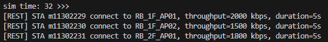
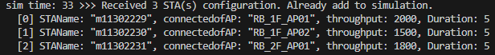

# Using RESTful API to Configure STA of ns-3

In this project, I implemented a RESTful API server within an ns-3 simulation. This allows the simulation to receive JSON-formatted data sent from SMO in real time. The goal is to enable external control the STA in ns-3 simulation.

- [Using RESTful API to Configure STA of ns-3](#using-restful-api-to-configure-sta-of-ns-3)
  - [What is a RESTful API?](#what-is-a-restful-api)
    - [Core Concepts:](#core-concepts)
    - [Advantages:](#advantages)
  - [Implementation Steps](#implementation-steps)
    - [1. REST Server Integration](#1-rest-server-integration)
    - [2. JSON format config file](#2-json-format-config-file)
    - [3.Send config file](#3send-config-file)
    - [4. Real-Time Interaction](#4-real-time-interaction)
    - [New Configuration Format (v2)](#new-configuration-format-v2)
    - [Appendix: Pistache framework](#appendix-pistache-framework)
      - [Pistache vs. httplib: Key Differences](#pistache-vs-httplib-key-differences)
      - [Summary](#summary)


## What is a RESTful API?

A **RESTful API (Representational State Transfer API)** is a type of web API that allows different systems to communicate over the internet using HTTP. 
It follows a set of design principles that make it **simple, scalable, and stateless**.


### Core Concepts:
 1. Resources
Everything is treated as a resource (e.g., users, products, orders). Each resource is identified by a URL.
Example: 
```shl=
GET /users/123  //retrieves user #123.
```

 2. HTTP Methods
Actions on resources are defined by standard HTTP methods:
* GET – Retrieve data
* POST – Create new data
* PUT – Update existing data (entire record)
* PATCH – Partially update data
* DELETE – Remove data
 3. Stateless
Each request contains all the information needed. The server does not store client context between requests.
 4. Uniform Interface
A consistent and predictable structure that simplifies interaction with the API.
 5. Data Format
Data is usually exchanged in **JSON format**, though XML or others can also be used.

### Advantages:
* Simple and easy to use
* Works over HTTP (widely supported)
* Language-agnostic (used in mobile, web, IoT, etc.)
* Scalable and flexible
 
 
 ## Implementation Steps
 
 ### 1. [REST Server Integration](https://github.com/bmw-ece-ntust/wifi-ns3/blob/will-daily/src/ns-3_files/scratch/wifi-dt-EMS.cc#L21)
* I used the cpp-httplib header-only C++ library to create a lightweight HTTP server directly inside the ns-3 program.
* The server listens for POST requests on a specific endpoint (e.g., /upload).

```cpp=
void StartRestServer() {
    Server svr;

    svr.Post("/upload", [](const Request& req, Response& res) {
        try {
            auto j = json::parse(req.body);

            if (j.contains("numberOfSTA") && j.contains("STAConfig") && j["STAConfig"].is_array()) {
                size_t numSta = j["numberOfSTA"];
                auto staConfigs = j["STAConfig"];

                if (staConfigs.size() == numSta) {
                    for (const auto& sta : staConfigs) {
                        std::string name = sta["STAName"];
                        std::string ap = sta["connectedofAP"];
                        int throughput = sta["throughput"];
                        int duration = sta["Duration"];
                        std::lock_guard<std::mutex> lock(g_mutex);
                        g_staConfigs.clear();
                        for (const auto& sta : staConfigs) {
                            g_staConfigs.push_back(sta);
                        }
                        g_triggerSend = true;

                        std::cout << "[REST] STA " << name << " connect to " << ap
                                  << ", throughput=" << throughput
                                  << " kbps, duration=" << duration << "s\n";
                    }
                    res.set_content("{\"status\": \"multi-sta ok\"}", "application/json");
                } else {
                    res.set_content("{\"status\": \"numberOfSTA mismatch STAConfig length\"}", "application/json");
                }
            } else {
                res.set_content("{\"status\": \"invalid json format\"}", "application/json");
            }

        } catch (const std::exception& e) {
            std::cerr << "JSON parsing error: " << e.what() << std::endl;
            res.set_content("{\"status\": \"invalid json\"}", "application/json");
        }
    });

    std::cout << "RESTful server listening on port 5000" << std::endl;
    svr.listen("0.0.0.0", 5000);
}
```

### 2. JSON format config file
* The server uses the nlohmann/json C++ library to parse incoming JSON strings.
* Example:

```json=
{
    "DateTime": "2025-04-22T15:38:56",
    "numberOfSTA": 3,
    "STAConfig": [
        {
            "STAName": "m11302229",
            "connectedofAP": "RB_1F_AP01",
            "throughput": 2000,
            "Duration": 5
        },
        {
            "STAName": "m11302230",
            "connectedofAP": "RB_1F_AP02",
            "throughput": 1500,
            "Duration": 5
        },
        {
            "STAName": "m11302231",
            "connectedofAP": "RB_2F_AP01",
            "throughput": 1800,
            "Duration": 5
        }
    ]
}
```

### 3.Send config file
* On a SMO, we can use a Python script or REST client (e.g., Postman or curl) sends a POST request to the ns-3 machine’s IP and port with the JSON data.
* Example command:
    * transmit string:
    ```shell=
    curl -X POST http://<ns3-ip>:8080/upload -H "Content-Type: application/json" -d '{"staId": 5, "triggerSend": true}'
    ```
    * transmit json file:
    ```shell=
    curl -X POST http://<ns3-ip>:5000/upload -H "Content-Type: application/json" --data-binary @sta-config.json
    ```


### 4. Real-Time Interaction
* In a ns-3 program, I have two threads, one for listening REST requests and another for running ns-3 simulation.
* When the REST server receives a REST request, the log prints the contents of the file


* Next second, the STAs will be add into the simulation.




### [New Configuration Format (v2)](https://hackmd.io/y0cCoDv6R6Cg6Fqxdr8Omg?view#Modify-STA-config-file)


### Appendix: Pistache framework
I Switched from Pistache to httplib

When I first attempted to build a RESTful API server in C++, I started with \[**Pistache**], a powerful HTTP framework offering features like routing, middleware support, and multithreading. However, during the installation and integration process, I encountered several major difficulties:

* **Complex installation**: Pistache uses **Meson** instead of the more common CMake, requiring additional tools like `ninja`, `meson`, and `gmock` to be installed manually.
* **High dependency overhead**: The build system failed due to missing dependencies like `RapidJSON` and `GTest`, and even after a successful `make`, the installation was blocked with the message "Please use Meson to install Pistache."
* **Hard to integrate with ns-3**: ns-3 uses CMake as its build system, so manually linking the Pistache headers and libraries caused compiler errors (e.g., `#include <pistache/endpoint.h>` not found).

Due to these issues, I switched to the **cpp-httplib** framework, a single-header C++ HTTP library. The experience was much smoother:

* Only requires downloading a single `.hpp` file.
* No external dependencies.
* Easy to integrate with ns-3 (just add `#include "httplib.h"` in your code).

#### Pistache vs. httplib: Key Differences

| Feature               | Pistache                                       | cpp-httplib                         |
| --------------------- | ---------------------------------------------- | ----------------------------------- |
| Installation          | Requires full build with Meson + Ninja + GTest | Header-only; just download one file |
| External Dependencies | High (RapidJSON, GTest, pthreads, Meson)       | Minimal to none                     |
| Routing Support       | Built-in router like Express                 | Manual path handling via if/else  |
| Multithreading        | Built-in thread pool                         | Single-threaded by default        |
| Ease of Use           | Medium to High                                 | Very easy                           |
| Best Use Case         | Production-level REST APIs                     | Rapid prototyping, embedded systems |
| ns-3 Integration      | Complicated, fragile build integration       | Simple and reliable               |

---

#### Summary

While **Pistache** is more powerful and feature-rich, it comes at the cost of installation complexity and dependency management. For simpler RESTful API needs—especially when integrating with simulation environments like **ns-3**—a lightweight header-only library like **cpp-httplib** offers a faster and more developer-friendly experience.
