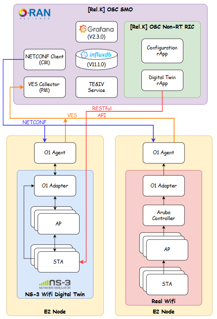

# ns-3 DT APs support features overview

---



### 📌 Objective

This note explains the structure, functionality, and key output metrics of the `ns3sim` class. The simulation is designed to deploy Wi-Fi Access Points (APs) with customizable standards (e.g., 802.11ax/n/ac), frequency bands (2.4GHz, 5GHz, or both), and energy consumption tracking. It also includes packet sink applications to monitor throughput and logs detailed runtime information for evaluation.

---

### 🧩 Code Structure Overview

#### 1. **StartSimulation() Entry Point**

This static function orchestrates the entire simulation setup and execution. It includes the following components:

---

#### 2. **AP Node Creation and Mobility**

```cpp
Ptr<Node> apNode = CreateObject<Node>();
```

* Nodes are created based on the AP list from `AccessPointManager`.
* Each AP node is positioned using `ConstantPositionMobilityModel` based on configured X/Y/Z coordinates.

---

#### 3. **Wi-Fi Configuration**

* **Standard Selection**: Supports 802.11ax, 802.11n, 802.11ac, 802.11g, and 802.11b.
* **Station Manager**: Uses `IdealWifiManager` for optimal rate control.
* **SSID**: Configurable for each AP.
* **Propagation Loss Models**:

  * `LogDistancePropagationLossModel`
  * `NakagamiPropagationLossModel`
  * `RangePropagationLossModel` (with 5m max range)

---

#### 4. **PHY & MAC Installation by Band**

* **2.4GHz (band == 1)** and **5GHz (band == 2)**:

  * Installs appropriate PHY helper with spatial stream support and Tx power settings.
* **Dual-band (band == 3)**:

  * Installs both 2.4GHz and 5GHz interfaces on the same AP node.
  * Each band is configured independently with different `TxPower` and channel settings.

---

#### 5. **Internet Stack and IP Assignment**

```cpp
InternetStackHelper stack;
Ipv4AddressHelper address;
```

* Installs the Internet stack on all AP nodes.
* Assigns IPs from a subnet (`10.1.0.0/20`).

---

#### 6. **Energy Model Setup**

* Uses `BasicEnergySource` and `WifiRadioEnergyModel`.
* Energy model parameters:

  * Voltage = 3V
  * Idle/Receive/Sleep currents are configured.
  * Tx current is modeled using `LinearWifiTxCurrentModel` with configurable efficiency `Eta`.
* Each `WifiNetDevice` is linked with an energy source and tracked.

---

#### 7. **Sink Applications**

* A `PacketSink` is installed per IP/device on each AP.
* Traffic sink listens on TCP port `777`.

---

### 📤 Key Simulation Outputs

#### 1. **Deployed AP Information**

```cpp
show_deployed_ap_info()
```

* Logs AP node names, positions, device types, Wi-Fi standard, channel width, frequency band, and channel number.

#### 2. **Throughput Report**

```cpp
show_throughput()
```

* Reports per-device throughput every 60 seconds.
* Uses packet sink statistics to calculate data rate in Kbps.

#### 3. **CO Statistics**

```cpp
show_CO()
```

* Placeholder for additional CO-related metrics, using `coTraceHelper`.

#### 4. **Energy Consumption**

```cpp
show_energy()
```

* Reports energy consumed (in Joules) per device every 60 seconds.
* Tracks incremental and total consumption using `WifiRadioEnergyModel`.

---

### ✅ Supported Features Summary

| Feature                     | Description                                                   |
| --------------------------- | ------------------------------------------------------------- |
| **Wi-Fi Standards**         | 802.11ax, n, ac, g, b                                         |
| **Band Configurations**     | 2.4GHz only, 5GHz only, or dual-band                          |
| **Custom Channel Settings** | 2.4GHz and 5GHz channel selection                             |
| **Energy Model**            | Supports idle, tx, rx, sleep current with efficiency modeling |
| **Throughput Logging**      | Per-device throughput monitored and printed                   |
| **Mobility Support**        | Static position allocator (constant position)                 |

---

### 📘 Conclusion

This simulation provides a versatile and extensible foundation for studying Wi-Fi AP behavior in ns-3, including energy efficiency and throughput performance under various PHY and MAC configurations. The logging functions offer deep visibility into runtime characteristics, making it suitable for experimentation with realistic network deployments or digital twin integration.

### Appedix

#### [Videos](https://youtu.be/u_YB286oYyg)

#### LOGs
```txt
Reicived APs configurations:
AP ID: 1, Name: RB_1F_AP01, SSID: ntust-peap, Standard: 802.11ax, Band: 3, Position: (0, 0, 0), CH1: 1, CH2: 36
AP ID: 2, Name: RB_1F_AP02, SSID: ntust-peap, Standard: 802.11n, Band: 1, Position: (10, 0, 0), CH1: 2, CH2: 0
AP ID: 3, Name: RB_1F_AP03, SSID: ntust-peap, Standard: 802.11ac, Band: 2, Position: (0, 10, 0), CH1: 0, CH2: 40
AP ID: 4, Name: RB_1F_AP04, SSID: ntust-peap, Standard: 802.11ax, Band: 3, Position: (10, 10, 0), CH1: 4, CH2: 44
------------------------------------------------------------------------------------------------------------------------------------------------------
Deployed APs infomations:
Node Name: RB_1F_AP01, Position: (0, 0, 0)
   Device[0]: ns3::WifiNetDevice, ssid=ntust-peap, Standard: 802.11ax, Channel Width: 20 MHz, BAND: 2.4 GHz, Channel Number: 1
   Device[1]: ns3::WifiNetDevice, ssid=ntust-peap, Standard: 802.11ax, Channel Width: 80 MHz, BAND: 5 GHz, Channel Number: 36
Node Name: RB_1F_AP02, Position: (10, 0, 0)
   Device[0]: ns3::WifiNetDevice, ssid=ntust-peap, Standard: 802.11n, Channel Width: 20 MHz, BAND: 2.4 GHz, Channel Number: 2
Node Name: RB_1F_AP03, Position: (0, 10, 0)
   Device[0]: ns3::WifiNetDevice, ssid=ntust-peap, Standard: 802.11ac, Channel Width: 80 MHz, BAND: 5 GHz, Channel Number: 40
Node Name: RB_1F_AP04, Position: (10, 10, 0)
   Device[0]: ns3::WifiNetDevice, ssid=ntust-peap, Standard: 802.11ax, Channel Width: 20 MHz, BAND: 2.4 GHz, Channel Number: 4
   Device[1]: ns3::WifiNetDevice, ssid=ntust-peap, Standard: 802.11ax, Channel Width: 80 MHz, BAND: 5 GHz, Channel Number: 44
======================================================================================================================================================
Node Name: RB_1F_AP01, Band: 2.4 GHz, Throughput: 0 Kbps
Node Name: RB_1F_AP01, Band: 5 GHz, Throughput: 0 Kbps
Node Name: RB_1F_AP02, Band: 2.4 GHz, Throughput: 0 Kbps
Node Name: RB_1F_AP03, Band: 5 GHz, Throughput: 0 Kbps
Node Name: RB_1F_AP04, Band: 2.4 GHz, Throughput: 0 Kbps
Node Name: RB_1F_AP04, Band: 5 GHz, Throughput: 0 Kbps

---- COT for RB_1F_AP01:0 ----
Showing duration by states: 
IDLE: +58.89s (98.33%)
TX:    +1.00s  (1.67%)

---- COT for RB_1F_AP01:1 ----
Showing duration by states: 
IDLE:  +59.70s  (99.71%)
TX:   +170.82ms  (0.29%)

---- COT for RB_1F_AP02:0 ----
Showing duration by states: 
IDLE:  +59.02s  (98.58%)
TX:   +847.08ms  (1.42%)

---- COT for RB_1F_AP03:0 ----
Showing duration by states: 
IDLE:  +59.73s  (99.76%)
TX:   +145.08ms  (0.24%)

---- COT for RB_1F_AP04:0 ----
Showing duration by states: 
IDLE: +58.81s (98.33%)
TX:    +1.00s  (1.67%)

---- COT for RB_1F_AP04:1 ----
Showing duration by states: 
IDLE:  +59.67s  (99.71%)
TX:   +170.82ms  (0.29%)

Energy consumption of devices:
    Node Name: RB_1F_AP01, Band: 2.4 GHz, Energy Consumed: 50.1432 J
    Node Name: RB_1F_AP01, Band: 5 GHz, Energy Consumed: 50.8511 J
    Node Name: RB_1F_AP02, Band: 2.4 GHz, Energy Consumed: 49.6754 J
    Node Name: RB_1F_AP03, Band: 5 GHz, Energy Consumed: 49.2853 J
    Node Name: RB_1F_AP04, Band: 2.4 GHz, Energy Consumed: 50.1432 J
    Node Name: RB_1F_AP04, Band: 5 GHz, Energy Consumed: 50.8511 J
======================================================================================================================================================
Node Name: RB_1F_AP01, Band: 2.4 GHz, Throughput: 0 Kbps
Node Name: RB_1F_AP01, Band: 5 GHz, Throughput: 0 Kbps
Node Name: RB_1F_AP02, Band: 2.4 GHz, Throughput: 0 Kbps
Node Name: RB_1F_AP03, Band: 5 GHz, Throughput: 0 Kbps
Node Name: RB_1F_AP04, Band: 2.4 GHz, Throughput: 0 Kbps
Node Name: RB_1F_AP04, Band: 5 GHz, Throughput: 0 Kbps

---- COT for RB_1F_AP01:0 ----
Showing duration by states: 
IDLE: +59.00s (98.33%)
TX:    +1.00s  (1.67%)

---- COT for RB_1F_AP01:1 ----
Showing duration by states: 
IDLE:  +59.84s  (99.71%)
TX:   +171.11ms  (0.29%)

---- COT for RB_1F_AP02:0 ----
Showing duration by states: 
IDLE:  +59.16s  (98.59%)
TX:   +848.53ms  (1.41%)

---- COT for RB_1F_AP03:0 ----
Showing duration by states: 
IDLE:  +59.86s  (99.76%)
TX:   +145.33ms  (0.24%)

---- COT for RB_1F_AP04:0 ----
Showing duration by states: 
IDLE: +59.00s (98.33%)
TX:    +1.00s  (1.67%)

---- COT for RB_1F_AP04:1 ----
Showing duration by states: 
IDLE:  +59.84s  (99.71%)
TX:   +171.11ms  (0.29%)

Energy consumption of devices:
    Node Name: RB_1F_AP01, Band: 2.4 GHz, Energy Consumed: 50.1422 J
    Node Name: RB_1F_AP01, Band: 5 GHz, Energy Consumed: 50.8511 J
    Node Name: RB_1F_AP02, Band: 2.4 GHz, Energy Consumed: 49.6754 J
    Node Name: RB_1F_AP03, Band: 5 GHz, Energy Consumed: 49.2853 J
    Node Name: RB_1F_AP04, Band: 2.4 GHz, Energy Consumed: 50.1432 J
    Node Name: RB_1F_AP04, Band: 5 GHz, Energy Consumed: 50.8511 J
```