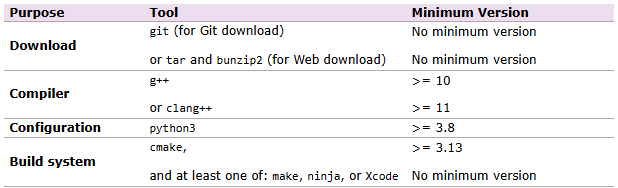

# ns-3 Installation Guide (for ns-3.45)
This guide provides step-by-step instructions for installing and building ns-3.45 from source on Ubuntu 20.04 using GCC-10, CMake, Python3, and other required packages.

## 1. Prerequisites
Make sure that your system has these prerequisites.


From the command line, you can check the version of each of the above tools with version requirements as follows:
* g++: `g++ --version`
* clang++: `clang++ --version`
* python3: `python3 -V`
* cmake: `cmake --version`

If the required tools are not yet installed or the versions do not meet the requirements, please start from Session 2. If all tools are already installed and the versions are correct, you may proceed directly to Session 3.

## 2. Download Necessary Tools or Libraries

### 2.1 Add Toolchain Repository
Add the GCC 10 toolchain PPA repository:
```bash
sudo add-apt-repository -y ppa:ubuntu-toolchain-r/test
sudo apt-get update
```

> **Explanation:** Ubuntu 20.04 provides gcc-9 by default; ns-3.45 requires gcc-10 for newer C++ standards.


### 2.2 Install Development Tools

Install gcc-10, g++-10, CMake, Ninja, and Python3 related packages:

```bash
sudo apt-get install -y gcc-10 g++-10
sudo update-alternatives --install /usr/bin/gcc gcc /usr/bin/gcc-10 100
sudo update-alternatives --install /usr/bin/g++ g++ /usr/bin/g++-10 100

sudo apt-get install -y git vim cmake ninja-build
sudo apt-get install -y python3 python3-dev python3-pip python3-pygraphviz python3-gi python3-gi-cairo ipython3
sudo apt-get install -y gir1.2-gtk-3.0 gir1.2-goocanvas-2.0
sudo apt-get install -y pkg-config qt5-qmake qt5-default qtchooser qtbase5-dev-tools qtbase5-dev libgtk-3-dev
```

Install the Python `cppyy` module for binding support:

```bash
python3 -m pip install --user cppyy==3.1.2
```


## 3. Download and Build ns-3

### 3.1 Download
Set up your workspace:

```bash
mkdir -p ns-3
cd ns-3
git clone https://gitlab.com/nsnam/ns-3-allinone.git
cd ns-3-allinone
python3 download.py -n ns-3.45
```

> **Explanation:**
> - `ns-3-allinone` manages source downloads and dependencies for ns-3.
> - `download.py -n ns-3.45` downloads only the specific ns-3.45 version.


### 3.2 Configure Build Options

Move to the ns-3.45 source folder and configure the build options:

```bash
cd ../../ns-3/ns-3-allinone/ns-3.45
./ns3 configure --enable-examples --enable-tests --enable-python-bindings
```

> **Explanation:**
> - `--enable-examples`: Enable example programs.
> - `--enable-tests`: Enable unit tests.
> - `--enable-python-bindings`: Enable Python bindings for ns-3 modules.

This command will create a `cmake-cache/` folder under `ns-3.45/`.

### 3.3 Build

After configuring, start the build process:

```bash
./ns3 build
```

> **Explanation:** This will compile the entire ns-3.45 project, including examples, tests, and Python bindings, based on the previously configured settings.

---

## 4. Verify the Installation

To verify if everything was installed correctly, run the basic example:

```bash
cd ~/ns3_wifi_dt/ns-3/ns-3-allinone/ns-3.45/
./ns3 run hello-simulator
```

If you see the output:
```
Hello Simulator
```

**Your ns-3.45 installation was successful!**

---

## 5. Appendix: Quick Installation Script
You can quickly install NS-3 by running below command.
```bash
cd ns3_wifi_dt/src/build/scripts/
sudo ./ns3_install.sh
```
You can specify the desired ns-3 version at the end of the script command. If no version is provided, the script will install ns-3.45 by default.
```bash
sudo ./ns3_install.sh 3.44
```
You can visit the [official ns-3 website](https://www.nsnam.org/releases/) to check for the latest version.

### Installation Script
#### [`ns3_install.sh`](../src/build/scripts/ns3_install.sh)

## Conclusion

Following this installation guide, you will have a fully functional **ns-3.45** environment, ready for simulation, development, and research.

