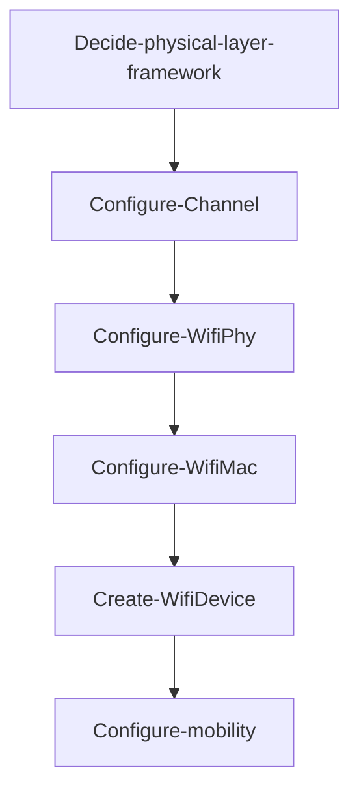

# ns-3 Wifi Use Documentation

- [ns-3 Wifi Use Documentation](#ns-3-wifi-use-documentation)
  - [Reference](#reference)
  - [1. WifiNetDevice create steps overview](#1-wifinetdevice-create-steps-overview)
    - [Example](#example)
  - [2. YansWifiChannelHelper](#2-yanswifichannelhelper)
    - [2.1 Create YansWifiChannel](#21-create-yanswifichannel)
    - [2.2 Example](#22-example)
    - [2.3 Propagation Loss Models](#23-propagation-loss-models)
    - [2.4 Propagation Delay Models](#24-propagation-delay-models)
  - [3. YansWifiPhyHelper](#3-yanswifiphyhelper)
    - [3.1 Create YansWifiPhy](#31-create-yanswifiphy)
    - [3.2 ErrorRateModel](#32-errorratemodel)
    - [3.3 Pcap tracing](#33-pcap-tracing)
    - [3.4 Attributes configuration](#34-attributes-configuration)
      - [example](#example-1)
      - [Attributes](#attributes)
    - [3.5 Channel, frequency, channel width, and band configuration](#35-channel-frequency-channel-width-and-band-configuration)
      - [setting an attribute value :](#setting-an-attribute-value-)
    - [3.5.1 Set Wifi Standard](#351-set-wifi-standard)
      - [Wifi Standards](#wifi-standards)
    - [3.5.2 Default settings for the operating channel](#352-default-settings-for-the-operating-channel)
      - [band, channel number and width unspecified :](#band-channel-number-and-width-unspecified-)
      - [example](#example-2)
    - [3.5.3 ChannelNumber](#353-channelnumber)
    - [3.5.4 Primary20MHzIndex](#354-primary20mhzindex)
    - [3.5.5 Order of operation issues](#355-order-of-operation-issues)
  - [4. SpectrumWifiPhyHelper](#4-spectrumwifiphyhelper)
  - [5. WifiMacHelper](#5-wifimachelper)
      - [Example](#example-3)
    - [5.1 Attributes configuration](#51-attributes-configuration)
      - [Attributes](#attributes-1)
    - [5.2 QoS support enabled](#52-qos-support-enabled)
      - [example](#example-4)
    - [5.3 HT, VHT, HE support enabled](#53-ht-vht-he-support-enabled)
      - [By default](#by-default)
      - [example](#example-5)
    - [5.4 Set Multi User Scheduler](#54-set-multi-user-scheduler)
    - [5.5 Selection of the Access Category (AC)](#55-selection-of-the-access-category-ac)
      - [example](#example-6)
  - [6. WifiHelper](#6-wifihelper)
    - [6.1 Create a WifiHelper](#61-create-a-wifihelper)
    - [6.2 Set RemoteStationManager](#62-set-remotestationmanager)
    - [6.3 Create WifiNetDevice](#63-create-wifinetdevice)
    - [6.4 Overwritten parameters](#64-overwritten-parameters)
    - [6.5 SetAckPolicySelectorForAc](#65-setackpolicyselectorforac)
      - [example](#example-7)
    - [6.6 SetObssPdAlgorithm](#66-setobsspdalgorithm)
      - [example](#example-8)
  - [7. HT configuration](#7-ht-configuration)
    - [Example](#example-9)
  - [8. VHT configuration](#8-vht-configuration)
    - [there are no VHT-specific configuration items to manage right now.](#there-are-no-vht-specific-configuration-items-to-manage-right-now)
  - [9. HE configuration](#9-he-configuration)
    - [Example](#example-10)
    - [9.1 SetMpduBufferSize](#91-setmpdubuffersize)
      - [example](#example-11)
    - [9.2 UL MU transmissions](#92-ul-mu-transmissions)
  - [10. Mobility configuration](#10-mobility-configuration)
    - [10.1 MobilityHelper](#101-mobilityhelper)
      - [example](#example-12)
    - [10.1.1 Position allocators](#1011-position-allocators)
    - [10.2 MobilityModel subclass](#102-mobilitymodel-subclass)
    - [10.2.1 MobilityModel Subclasses list](#1021-mobilitymodel-subclasses-list)
    - [10.3 Install in nodes](#103-install-in-nodes)


## Reference

* [ns-3 Wi-Fi Module User Documentation](https://www.nsnam.org/docs/release/3.39/models/html/wifi-user.html?highlight=setstandard)
* [ns-3 Documentation](https://www.nsnam.org/docs/release/3.18/doxygen/index.html) **(path : ns-3 > Classes > Class List > ns3 > ....)**


## 1. WifiNetDevice create steps overview
ns-3 Wifi module structure : 


Commonly used flow : 


1. Decide physical layer framework.
    * **SpectrumWifiPhy** or **YansWifiPhy**. 
    * This will affect which Channel and Phy type to use.
2. [Configure the Channel.](#2-YansWifiChannelHelper)
    * The main configurations of WifiChannel are [**propagation loss model**](#23-Propagation-Loss-Models) and [**propagation delay model**](#24-Propagation-Delay-Models).
    * Channel takes care of getting signal from one device to other devices on the same Wi-Fi channel. 
3. [Configure the WifiPhy.](#3-YansWifiPhyHelper)
    * The main configuration of WifiPhy is the [**error rate model**](#32-ErrorRateModel).
        * calculates the probability of successfully decoding the frame based on the signal.
    * WifiPhy decides whether each frame will be successfully decoded or not depending on the received signal(from Channel) strength and noise.
4. [Configure WifiMac.](#5-WifiMacHelper)
    * Configure the wifi architecture
        * **ad-hoc** or **ap-sta** 
    * [decides whether features are supported or not.](#52-QoS-support-enabled)
        * [**QoS (802.11e)**](#55-Selection-of-the-Access-Category-AC), [**HT (802.11n)**](#7-HT-configuration) and/or [**VHT (802.11ac)**](#8-VHT-configuration) and/or [**HE (802.11ax)**](#9-HE-configuration)
5. [Create WifiDevice.](#63-Create-WifiNetDevice)
    * Configure wifi standard
        * **802.11b, 802.11g, 802.11a, 802.11n, 802.11ac or 802.11ax**
    * and [**rate control algorithm(Set RemoteStationManager)**](#62-Set-RemoteStationManager).
6. [Configure mobility.](#10-Mobility-configuration)
    * Configure a mobility model 
        * their relative positions are needed for **propagation loss calculations**.

### Example
```cpp=
NodeContainer wifiStaNode;
wifiStaNode.Create(10);   // Create 10 station node objects
NodeContainer wifiApNode;
wifiApNode.Create(1);   // Create 1 access point node object

// Create a channel helper and phy helper, and then create the channel
YansWifiChannelHelper channel = YansWifiChannelHelper::Default();
YansWifiPhyHelper phy = YansWifiPhyHelper::Default();
phy.SetChannel(channel.Create());

// Create a WifiMacHelper, which is reused across STA and AP configurations
WifiMacHelper mac;

// Create a WifiHelper, which will use the above helpers to create
// and install Wifi devices.  Configure a Wifi standard to use, which
// will align various parameters in the Phy and Mac to standard defaults.
WifiHelper wifi;
wifi.SetStandard(WIFI_STANDARD_80211n);
// Declare NetDeviceContainers to hold the container returned by the helper
NetDeviceContainer wifiStaDevices;
NetDeviceContainer wifiApDevice;

// Perform the installation
mac.SetType("ns3::StaWifiMac");
wifiStaDevices = wifi.Install(phy, mac, wifiStaNodes);
mac.SetType("ns3::ApWifiMac");
wifiApDevice = wifi.Install(phy, mac, wifiApNode);

// mobility....
```


## 2. [YansWifiChannelHelper](https://www.nsnam.org/docs/release/3.19/doxygen/classns3_1_1_yans_wifi_channel_helper.html)

### 2.1 Create YansWifiChannel
To create the defaults YansWifiChannel with code :
```cpp=
YansWifiChannelHelper wifiChannelHelper = YansWifiChannelHelper::Default();
Ptr<Channel> wifiChannel = wifiChannelHelper.Create();
```
* the default channel model of propagation delay equal to a constant, the **speed of light**.
    * ```ns3::ConstantSpeedPropagationDelayModel```
* the default channel model of propagation loss is based on a default log distance model, using a default exponent of 3.
    * ```ns3::LogDistancePropagationLossModel```
    * the default log distance model is configured with a reference loss of 46.6777 dB at reference distance of 1m.
    * 46.6777 dB was calculated using Friis propagation loss model **at 5.15 GHz**.
        * If band is 2.4 GHz(802.11b, 802.11g, 802.11n or 802.11ax), the reference loss must be changed.
* Use ```YansWifiChannelHelper::SetPropagationDelay()``` to set PropagationDelayModel
* Use ```YansWifiChannelHelper::AddPropagationLoss()``` to add PropagationLossModel
### 2.2 Example
```cpp=
YansWifiChannelHelper channel = YansWifiChannelHelper::Default();
channel.AddPropagationLoss("ns3::RangePropagationLossModel");
// wireless range limited to 5 meters!
Config::SetDefault("ns3::RangePropagationLossModel::MaxRange", DoubleValue(5));
```
### 2.3 [Propagation Loss Models](https://www.nsnam.org/docs/release/3.25/doxygen/group__propagation.html)
Propagation Loss Models
* [```ns3::BuildingsPropagationLossModel```](https://www.nsnam.org/docs/release/3.19/doxygen/classns3_1_1_buildings_propagation_loss_model.html#details) 
    * for simulating the propagation phenomena in the buildings
* [```ns3::Cost231PropagationLossModel```](https://www.nsnam.org/docs/release/3.25/doxygen/classns3_1_1_cost231_propagation_loss_model.html#details)
    * Also called the Hata Model PCS Extension, it is a radio propagation model
* [```ns3::FixedRssLossModel```](https://www.nsnam.org/docs/release/3.19/doxygen/classns3_1_1_fixed_rss_loss_model.html#details)
    * Return a constant received power level independent of the transmit power
* [```ns3::FriisPropagationLossModel```](https://www.nsnam.org/docs/release/3.19/doxygen/classns3_1_1_friis_propagation_loss_model.html#details)
    * a Friis propagation loss model 
* [```ns3::HybridBuildingsPropagationLossModel```](https://www.nsnam.org/docs/release/3.19/doxygen/classns3_1_1_hybrid_buildings_propagation_loss_model.html#details)
    * is a compound of different models able to use in different environments and with buildings
* [```ns3::ItuR1411LosPropagationLossModel```](https://www.nsnam.org/docs/release/3.19/doxygen/classns3_1_1_itu_r1411_los_propagation_loss_model.html#details)
    * implements the ITU-R 1411 LOS propagation model for Line-of-Sight (LoS) short range outdoor communication in the frequency range 300 MHz to 100 GHz.
* [```ns3::ItuR1411NlosOverRooftopPropagationLossModel```](https://www.nsnam.org/docs/release/3.19/doxygen/classns3_1_1_itu_r1411_nlos_over_rooftop_propagation_loss_model.html#details)
    * implements the ITU-R 1411 LOS propagation model for Non-Line-of-Sight (NLoS) short range outdoor communication over rooftops in the frequency range 300 MHz to 100 GHz.
* [```ns3::JakesPropagationLossModel```](https://www.nsnam.org/docs/release/3.19/doxygen/classns3_1_1_jakes_propagation_loss_model.html#details)
    * a jakes narrowband propagation model.
* [```ns3::Kun2600MhzPropagationLossModel```](https://www.nsnam.org/docs/release/3.19/doxygen/classns3_1_1_kun2600_mhz_propagation_loss_model.html#details)
    * Empirical propagation model for the 2.6 GHz frequency.
* [```ns3::LogDistancePropagationLossModel```](https://www.nsnam.org/docs/release/3.19/doxygen/classns3_1_1_log_distance_propagation_loss_model.html#details)
    * a log distance propagation model.
* [```ns3::MatrixPropagationLossModel```](https://www.nsnam.org/docs/release/3.19/doxygen/classns3_1_1_matrix_propagation_loss_model.html#details)
    * The propagation loss is fixed for each pair of nodes and doesn't depend on their actual positions.
* [```ns3::NakagamiPropagationLossModel```](https://www.nsnam.org/docs/release/3.19/doxygen/classns3_1_1_nakagami_propagation_loss_model.html#details)
    * Nakagami-m fast fading propagation loss model.
* [```ns3::OhBuildingsPropagationLossModel```](https://www.nsnam.org/docs/release/3.19/doxygen/classns3_1_1_oh_buildings_propagation_loss_model.html#details)
    * combines the OkumuraHata model with the BuildingsPropagationLossModel
* [```ns3::OkumuraHataPropagationLossModel```](https://www.nsnam.org/docs/release/3.19/doxygen/classns3_1_1_okumura_hata_propagation_loss_model.html#details)
    * implements the Okumura Hata propagation loss model
* [```ns3::RandomPropagationLossModel```](https://www.nsnam.org/docs/release/3.19/doxygen/classns3_1_1_random_propagation_loss_model.html#details)
    * The propagation loss follows a random distribution.
* [```ns3::RangePropagationLossModel```](https://www.nsnam.org/docs/release/3.19/doxygen/classns3_1_1_range_propagation_loss_model.html#details)
    * The propagation loss depends only on the distance (range) between transmitter and receiver.
* [```ns3::ThreeLogDistancePropagationLossModel```](https://www.nsnam.org/docs/release/3.19/doxygen/classns3_1_1_three_log_distance_propagation_loss_model.html#details)
    * A log distance path loss propagation model with three distance fields.
* [```ns3::TwoRayGroundPropagationLossModel```](https://www.nsnam.org/docs/release/3.19/doxygen/classns3_1_1_two_ray_ground_propagation_loss_model.html#details)
    * a Two-Ray Ground propagation loss model ported from NS2


### 2.4 [Propagation Delay Models](https://www.nsnam.org/docs/release/3.25/doxygen/group__propagation.html)
Propagation Delay Models
* [```ns3::ConstantSpeedPropagationDelayModel```](https://www.nsnam.org/docs/release/3.25/doxygen/classns3_1_1_constant_speed_propagation_delay_model.html#details)
    * the propagation speed is constant
* [```ns3::RandomPropagationDelayModel```](https://www.nsnam.org/docs/release/3.19/doxygen/classns3_1_1_random_propagation_delay_model.html#details)
    * the propagation delay is random


## 3. [YansWifiPhyHelper](https://www.nsnam.org/docs/release/3.18/doxygen/classns3_1_1_yans_wifi_phy_helper.html)
Physical devices (base class ns3::WifiPhy) connect to ns3::YansWifiChannel models in ns-3. 

### 3.1 Create YansWifiPhy
* Create YansWifiPhy and connected it to YansWifichannel.
```cpp=
YansWifiPhyHelper wifiPhyHelper;
wifiPhyHelper.SetChannel(wifiChannel);
```

### 3.2 ErrorRateModel
* The default YansWifiPhyHelper is configured with TableBasedErrorRateModel (ns3::TableBasedErrorRateModel).
    * change the error rate model by calling the ```YansWifiPhyHelper::SetErrorRateModel()```
* Error Rate Models : 
    * ```ns3::TableBasedErrorRateModel```
    * [```ns3::YansErrorRateModel```](https://www.nsnam.org/docs/release/3.18/doxygen-bak/classns3_1_1_yans_error_rate_model.html)
    * [```ns3::DsssErrorRateModel```](https://www.nsnam.org/docs/release/3.19/doxygen/classns3_1_1_dsss_error_rate_model.html)
    * [```ns3::NistErrorRateModel```](https://www.nsnam.org/docs/release/3.18/doxygen-bak/classns3_1_1_nist_error_rate_model.html)

### 3.3 Pcap tracing
* If pcap tracing is needed, use the following command to enable pcap tracing:
```cpp=
YansWifiPhyHelper::SetPcapDataLinkType(enum SupportedPcapDataLinkTypes dlt)
```
* Supported Pcap Data Link Types :


### 3.4 [Attributes configuration](https://www.nsnam.org/doxygen/dc/d2d/classns3_1_1_wifi_phy.html#details)

In order to enable some specific environment, we can use [```ns3::YansWifiPhyHelper::set```](https://www.nsnam.org/docs/release/3.18/doxygen/classns3_1_1_yans_wifi_phy_helper.html#aa6203c5571a0f96f48869c458b7c164d) to set the attributes of the underlying PHY object.

#### example 
* this code enables MIMO with 2 antennas and 2 spatial streams:
```cpp=
wifiPhyHelper.Set("Antennas", UintegerValue(2));
wifiPhyHelper.Set("MaxSupportedTxSpatialStreams", UintegerValue(2));
wifiPhyHelper.Set("MaxSupportedRxSpatialStreams", UintegerValue(2));
```

#### Attributes

* Antennas
* CcaEdThreshold
* CcaSensitivity
* Channel
* ChannelNumber
* ChannelSettings
* ChannelSwitchDelay
* ChannelWidth
* FixedPhyBand
* FrameCaptureModel
* Frequency
* InterferenceHelper
* MaxSupportedRxSpatialStreams
* MaxSupportedTxSpatialStreams
* Pifs
* PostReceptionErrorModel
* PowerDensityLimit
* PreambleDetectionModel
* Primary20MHzIndex
* RxGain
* RxNoiseFigure
* RxSensitivity
* ShortPlcpPreambleSupported
* Sifs
* Slot
* State
* TxGain
* TxPowerEnd
* TxPowerLevels
* TxPowerStart


### 3.5 Channel, frequency, channel width, and band configuration

* ```ns3::WifiPhy ChannelSettings``` attribute, that enables to set **channel number**, **channel width**, **frequency band** and **primary20 index** all together.
    * primary20 index :  It set the index of the primary 20 MHz channel (0 indicates the 20 MHz subchannel with the lowest center frequency) if the channel width is a multiple of 20 MHz.
        * it usually equal to zero.
* The ChannelSettings attribute can be set in two ways : 
    * StringValue object or TupleValue object:

#### setting an attribute value : 
```cpp=
Config::SetDefault("ns3::WifiPhy::ChannelSettings", StringValue("{38, 40, BAND_5GHZ, 0}"));
```
or
```cpp=
//TupleValue object
TupleValue<UintegerValue, UintegerValue, EnumValue, UintegerValue> value;
value.Set(WifiPhy::ChannelTuple {38, 40, WIFI_PHY_BAND_5GHZ, 0});

//or StringValue value("{38, 40, BAND_5GHZ, 0}"));  //StringValue object

YansWifiPhyHelper wifiPhyHelper = YansWifiPhyHelper::Default();
wifiPhyHelper.Set("ChannelSettings", value);
```
or
```cpp=
Config::Set("/NodeList/0/DeviceList/*/$ns3::WifiNetDevice/Phy/$ns3::WifiPhy/ChannelSettings",
StringValue("{38, 40, BAND_5GHZ, 0}"));
```

### 3.5.1 Set Wifi Standard
* We can use ```WifiHelper::SetStandard()``` to set various parameters in the Mac and Phy to standard values
    * For instance, a channel in the 2.4 GHz band cannot be configured if the standard is 802.11ac
    * or a channel in the 6 GHz band can only be configured if the standard is 802.11ax (or beyond).
* WifiStandard are defined in ```src/wifi/model/wifi-standards.h```
* If user has not already configured ChannelSettings when SetStandard is called, the user obtains default values

#### Wifi Standards
* WIFI_STANDARD_UNSPECIFIED
* WIFI_STANDARD_80211a
* WIFI_STANDARD_80211b
* WIFI_STANDARD_80211g
* WIFI_STANDARD_80211p
* WIFI_STANDARD_80211n
* WIFI_STANDARD_80211ac
* WIFI_STANDARD_80211ad
* WIFI_STANDARD_80211ax
* WIFI_STANDARD_80211be

### 3.5.2 Default settings for the operating channel

Not all the parameters in the channel settings have to be set to a valid value, but they can be left unspecified, in which case **default values are substituted as soon as the WifiStandard is set**.

About setting channel number, can see [3.5.3](https://hackmd.io/SdtBQ9-bT9utHKhuCtCATQ?view#353-ChannelNumber).

Rules : 
1. If the band is unspecified(WIFI_PHY_BAND_UNSPECIFIED or “BAND_UNSPECIFIED”)
    
| Wifi standard        | default channel band |
|:-------------------- |:-------------------- |
| 802.11{a, ac, ax, p} | 5 GHz                |
| all the others       | 2.4 GHz              |

2. If both the channel width and the channel number are unspecified(zero)
    
| Wifi standard                   | default channel width |
|:------------------------------- |:------------- |
| 802.11b                         | 22 MHz        |
| 802.11p                         | 10 MHz        |
| 802.11ac                        | 80 MHz        |
| 802.11ax (if the band is 5 GHz) | 80 MHz        |
| all other cases                 | 20 MHz        |

```cpp=
WifiHelper wifi;
wifi.SetStandard(WIFI_STANDARD_80211ax);
YansWifiPhyHelper phyHelper;
phyHelper.Set("ChannelSettings", StringValue("{0, 0, BAND_2_4GHZ, 0}"));
// both channel number and width unspecified
// -> width set to 20 MHz (default width for 802.11ax in the 2.4 GHZ band)
// -> channel number set to 1 (first 20 MHz channel in the 2.4 GHz band)(Rule2)
```
3. If the channel width is unspecified but the channel number is valid, the settings are valid only if there exists a unique channel with the given number for the configured standard and band.
    * Otherwise, the simulation aborts.
```cpp=
WifiHelper wifi;
wifi.SetStandard(WIFI_STANDARD_80211ac);
YansWifiPhyHelper phyHelper;
phyHelper.Set("ChannelSettings", StringValue("{58, 0, BAND_5GHZ, 0}"));
// channel width unspecified, channel number is valid(58)
// -> it is set to 80 MHz (standard is 80211ac)(Rule2)
//channel number 58 is first 80 MHz channel in the 5 GHz band
//simulation will not aborts(Rule3)
```
4. If the channel number is unspecified(zero)
    * the default channel number for the configured standard, band and channel width is used
    * [channel number table](https://hackmd.io/SdtBQ9-bT9utHKhuCtCATQ?view#353-ChannelNumber)
```cpp=
WifiHelper wifi;
wifi.SetStandard(WIFI_STANDARD_80211n);
YansWifiPhyHelper phyHelper;
phyHelper.Set("ChannelSettings", StringValue("{0, 40, BAND_5GHZ, 0}"));
// channel number unspecified
// -> it is set to channel 38 (first 40 MHz channel in the 5GHz band)(Rule4)
```

#### band, channel number and width unspecified : 

| Wifi standard | default channel number | default channel width | default frequency band |
|:------------- |:---------------------- |:--------------------- |:---------------------- |
| 80211a        | 36                     | 20 MHz                | 5 GHz                  |
| 80211b        | 1                      | 22 MHz                | 2.4 GHz                |
| 80211g        | 1                      | 20 MHz                | 2.4 GHz                |
| 80211p        | 172                    | 10 MHz                | 5 GHz                  |
| 80211n        | 1                      | 20 MHz                | 2.4 GHz                |
| 80211ac       | 42                     | 80 MHz                | 5 GHz                  |
| 80211ax       | 42                     | 80 MHz                | 5 GHz                  |

#### example
```cpp=
WifiHelper wifi;
wifi.SetStandard(WIFI_STANDARD_80211a);
YansWifiPhyHelper phyHelper;
phyHelper.Set("ChannelSettings", StringValue("{0, 0, BAND_UNSPECIFIED, 0}"));
// band, channel number and width unspecified
// -> band is set to WIFI_PHY_BAND_5GHZ (default band for 802.11a)(Rule1)
// -> width set to 20 MHz (default width for 802.11a in the 5 GHZ band)(Rule2)
// -> channel number set to 36 (first 20 MHz channel in the 5 GHz band)(Rule4)
```

### 3.5.3 ChannelNumber

The configured WifiPhy channel number can be got via the attribute ```ChannelNumber``` in the class ```WifiPhy```.

* If a ChannelNumber is defined, it means that WifiPhy has stored a map of ChannelNumber to the center frequency and channel width commonly known for that channel in practice. For example:
    * Channel 1, when IEEE 802.11b is configured, corresponds to a channel width of 22 MHz and a center frequency of 2412 MHz.
    * Channel 36, when IEEE 802.11n is configured at 5 GHz, corresponds to a channel width of 20 MHz and a center frequency of 5180 MHz.
* The following channel numbers are well-defined for 2.4 GHz standards:
    * channels 1-14 with ChannelWidth of 22 MHz for 802.11b
    * channels 1-14 with ChannelWidth of 20 MHz for 802.11n-2.4GHz and 802.11g
* The following channel numbers are well-defined for 5 GHz standards:

|  ChannelWidth  | ChannelNumber                                                                                                       |
|:--------------:|:------------------------------------------------------------------------------------------------------------------- |
|     20MHz      | 36, 40, 44, 48, 52, 56, 60, 64, 100, 104, 108, 112, 116, 120, 124, 128, 132, 136, 140, 144, 149, 153, 161, 165, 169 |
|     40MHz      | 38, 46, 54, 62, 102, 110, 118, 126, 134, 142, 151, 159                                                              |
|     80MHz      | 42, 58, 106, 122, 138, 155                                                                                          |
|    1600MHz     | 50, 114                                                                                                             |
| 10MHz(802.11p) | 172, 174, 176, 178, 180, 182, 184                                                                                   |
| 5MHz(802.11p)  | 171, 173, 175, 177, 179, 181, 183                                                                                   |
* The following channel numbers are well-defined for 6 GHz standards (802.11ax only):

| ChannelWidth | ChannelNumber                                                                                                                                                                                                                                                             |
|:------------:|:------------------------------------------------------------------------------------------------------------------------------------------------------------------------------------------------------------------------------------------------------------------------- |
|    20MHz     | 1, 5, 9, 13, 17, 21, 25, 29, 33, 37, 41, 45, 49, 53, 57, 61, 65, 69, 73, 77, 81, 85, 89, 93, 97, 101, 105, 109, 113, 117, 121, 125, 129, 133, 137, 141, 145, 149, 153, 157, 161, 165, 169, 173, 177, 181, 185, 189, 193, 197, 201, 205, 209, 213, 217, 221, 225, 229, 233 |
|    40MHz     | 3, 11, 19, 27, 35, 43, 51, 59, 67, 75, 83, 91, 99, 107, 115, 123, 131, 139, 147, 155, 163, 171, 179, 187, 195, 203, 211, 219, 227                                                                                                                                         |
|    80MHz     | 7, 23, 39, 55, 71, 87, 103, 119, 135, 151, 167, 183, 199, 215                                                                                                                                                                                                             |
|    160MHz    | 15, 47, 79, 111, 143, 175, 207                                                                                                                                                                                                                                            |

* If an unknown channel number (other than zero) is configured, simulator will exit with an error
* If a known channel number is configured against an incorrect value of the WifiPhyStandard, simulator will exit with an error
* we can edit file ```src/wifi/model/wifi-phy-operating-channel.cc``` to extend to additional channel numbers.

### 3.5.4 Primary20MHzIndex
The configured WifiPhy primary 20MHz channel index can be got via the attribute ```Primary20MHzIndex``` in the class ```WifiPhy```.

### 3.5.5 Order of operation issues
* Channel settings can be configured **either before or after the wifi standard**. If the channel settings are configured before the wifi standard, the channel settings are stored and applied when the wifi standard is configured. Otherwise, they are applied immediately.
* The wifi standard can be configured only once, it is not possible to change standard during a simulation. 
* It is instead possible to change the channel settings at any time.

## 4. SpectrumWifiPhyHelper
* Its API has been extended for 802.11be multi-link and EMLSR in order to attach multiple spectrum channels to a same PHY. 
* must be used with channel of type ```ns3::SpectrumChannel```
* use the following command to attach a spectrum channel to the PHY objects that will be created upon a call to ```ns3::WifiHelper::Install``` : 
```cpp=
SpectrumWifiPhyHelper::SetPcapDataLinkType(const Ptr<SpectrumChannel> channel,
                                           const FrequencyRange& freqRange)
```
* FrequencyRange is a structure that contains the start and stop frequencies expressed in MHz which corresponds to the spectrum portion that is covered by the channel.

## 5. WifiMacHelper
* This step is to configure the MAC model.
    * Use ```WifiMacHelper``` to accomplish this.
    * ```WifiMacHelper``` include the **MAC low model** and **MAC high model**
* It is used to configure MAC parameters like type of MAC
    * 802.11/WMM-style QoS
    * 802.11n-style High Throughput (HT)
    * 802.11ac-style Very High Throughput (VHT)
    * 802.11ax-style High Efficiency (HE)
* When selecting 802.11n as the wifi standard, both QoS and HT support gets enabled. 
* when selecting 802.11ac as the wifi standard, QoS, HT and VHT support gets enabled.
* when selecting 802.11ax as the wifi standard, QoS, HT, VHT and HE support gets enabled.
* By default
    * It creates an ad-hoc MAC instance
    * Does not have QoS nor HT nor VHT nor HE support enabled.

#### Example 
the following code configures a non-QoS and non-HT/non-VHT/non-HE MAC that will be **a non-AP STA** in an infrastructure network where the AP has SSID ns-3-ssid:
```cpp=
WifiMacHelper wifiMacHelper;
Ssid ssid = Ssid("ns-3-ssid");
wifiMacHelper.SetType("ns3::StaWifiMac",
                     "Ssid", SsidValue(ssid),
                     "ActiveProbing", BooleanValue(false));
```
* To create ad-hoc MAC instances
    * use ```ns3::AdhocWifiMac```
* To create ap-sta MAC instances
    * use ```ns3::StaWifiMac``` and ```ns3::ApWifiMac```

### 5.1 [Attributes configuration](https://www.nsnam.org/docs/release/3.39/doxygen/d3/d57/classns3_1_1_wifi_mac.html#details)
We can use ```ns3::WifiMacHelper::SetType``` to configure some attributes.
#### Attributes
* BE_BlockAckInactivityTimeout
* BE_BlockAckThreshold
* BE_MaxAmpduSize
* BE_MaxAmsduSize
* BE_Txop
* BK_BlockAckInactivityTimeout
* BK_BlockAckThreshold
* BK_MaxAmpduSize
* BK_MaxAmsduSize
* BK_Txop
* CtsToSelfSupported
* QosSupported
* ShortSlotTimeSupported
* Ssid
* Txop
* VI_BlockAckInactivityTimeout
* VI_BlockAckThreshold
* VI_MaxAmpduSize
* VI_MaxAmsduSize
* VI_Txop
* VO_BlockAckInactivityTimeout
* VO_BlockAckThreshold
* VO_MaxAmpduSize
* VO_MaxAmsduSize
* VO_Txop


### 5.2 QoS support enabled

With QoS-enabled MAC models it is possible to work with traffic belonging to four different Access Categories (ACs): 
* AC_VO 
    * for voice traffic
* AC_VI 
    * for video traffic
* AC_BE 
    * for best-effort traffic 
* AC_BK 
    * for background traffic.

For MAC instances that have QoS support enabled, the ```ns3::WifiMacHelper``` can be used to set:
* block ack threshold (number of packets for which block ack mechanism should be used);
* block ack inactivity timeout.

#### example
following code configures a MAC that will be a **non-AP STA with QoS enabled** and a **block ack threshold for AC_BE set to 2 packets**:
```cpp=
WifiMacHelper wifiMacHelper;
Ssid ssid = Ssid("ns-3-ssid");
wifiMacHelper.SetType("ns3::StaWifiMac",
                     "Ssid", SsidValue(ssid),
                     "QosSupported", BooleanValue(true),
                     "BE_BlockAckThreshold", UintegerValue(2),
                     "ActiveProbing", BooleanValue(false));
```

### 5.3 HT, VHT, HE support enabled

For MAC instances that have 802.11n-style High Throughput (HT) and/or 802.11ac-style Very High Throughput (VHT) and/or 802.11ax-style High Efficiency (HE) support enabled, the ```ns3::WifiMacHelper``` can be used to set:
* MSDU aggregation parameters for a particular Access Category (AC) in order to use 802.11n/ac A-MSDU feature;
* MPDU aggregation parameters for a particular Access Category (AC) in order to use 802.11n/ac A-MPDU feature.

#### By default
* MSDU aggregation feature is disabled for all ACs and MPDU aggregation is enabled for AC_VI and AC_BE, with a maximum aggregation size of 65535 bytes.

#### example
following code configures a MAC that will be a non-AP STA with HT and QoS enabled, MPDU aggregation enabled for AC_VO with a maximum aggregation size of 65535 bytes, and MSDU aggregation enabled for AC_BE with a maximum aggregation size of 7935 bytes:
```cpp=
WifiHelper wifi;
wifi.SetStandard(WIFI_STANDARD_80211n);

WifiMacHelper wifiMacHelper;
Ssid ssid = Ssid("ns-3-ssid");
wifiMacHelper.SetType("ns3::StaWifiMac",
                      "Ssid", SsidValue(ssid),
                      "VO_MaxAmpduSize", UintegerValue(65535),
                      "BE_MaxAmsduSize", UintegerValue(7935),
                      "ActiveProbing", BooleanValue(false));
```

### 5.4 Set Multi User Scheduler

802.11ax APs support sending multi-user frames via DL OFDMA and UL OFDMA if a Multi-User Scheduler is aggregated to the wifi MAC(by default no scheduler is aggregated).

WifiMacHelper enables to aggregate a Multi-User Scheduler to an AP and set its parameters:
```cpp=
WifiMacHelper wifiMacHelper;
wifiMacHelper.SetMultiUserScheduler("ns3::RrMultiUserScheduler",
                                    "EnableUlOfdma", BooleanValue(true),
                                    "EnableBsrp", BooleanValue(false));
```

### 5.5 Selection of the Access Category (AC)
* The selection of the Access Category (AC) for an MSDU is based on the value of the DS field in the IP header of the packet (ToS field in case of IPv4, Traffic Class field in case of IPv6). 
* Details on how to set the ToS field of IPv4 packets are given in the [ToS (Type of Service)](https://www.nsnam.org/docs/release/3.39/models/html/sockets-api.html#type-of-service) section of the documentation. 
* In summary, users can create an address of type ```ns3::InetSocketAddress``` with the desired type of service value and pass it to the application helpers:
```cpp=
InetSocketAddress destAddress(ipv4Address, udpPort);
destAddress.SetTos(tos);
OnOffHelper onoff("ns3::UdpSocketFactory", destAddress);
```


* The Access Category is then determined based on the user priority according to the following table:

| UP  | Access Category |
|:---:|:--------------- |
|  7  | AC_VO           |
|  6  | AC_VO           |
|  5  | AC_VI           |
|  4  | AC_VI           |
|  3  | AC_BE           |
|  0  | AC_BE           |
|  2  | AC_BK           |
|  1  | AC_BK           |

* TOS and DSCP values map onto user priorities and access categories according to the following table:


| DiffServ PHB | TOS (binary) | UP  | Access Category |
|:------------:|:------------:| --- |:--------------- |
|      EF      |   101110xx   | 5   | AC_VI           |
|     AF11     |   001010xx   | 1   | AC_BK           |
|     AF21     |   010010xx   | 2   | AC_BK           |
|     AF31     |   011010xx   | 3   | AC_BE           |
|     AF41     |   100010xx   | 4   | AC_VI           |
|     AF12     |   001100xx   | 1   | AC_BK           |
|     AF22     |   010100xx   | 2   | AC_BK           |
|     AF32     |   011100xx   | 3   | AC_BE           |
|     AF42     |   100100xx   | 4   | AC_VI           |
|     AF13     |   001110xx   | 1   | AC_BK           |
|     AF23     |   010110xx   | 2   | AC_BK           |
|     AF33     |   011110xx   | 3   | AC_BE           |
|     AF43     |   100110xx   | 4   | AC_VI           |
|     CS0      |   000000xx   | 0   | AC_BE           |
|     CS1      |   001000xx   | 1   | AC_BK           |
|     CS2      |   010000xx   | 2   | AC_BK           |
|     CS3      |   011000xx   | 3   | AC_BE           |
|     CS4      |   100000xx   | 4   | AC_VI           |
|     CS5      |   101000xx   | 5   | AC_VI           |
|     CS6      |   110000xx   | 6   | AC_VO           |
|     CS7      |   111000xx   | 7   | AC_VO           |

#### example 

```cpp=
destAddress.SetTos(0xc0);
```
* The code will map to CS6
* User Priority 6
* Access Category AC_VO. 

## 6. WifiHelper
We’re now ready to create WifiNetDevices. 

### 6.1 Create a WifiHelper

* Create a WifiHelper with : 
```cpp=
WifiHelper wifiHelper;
```
* default settings:
    * It will set the default wifi standard to 802.11a.
        * To change the wifi standard : call the [```WifiHelper::SetStandard```](https://hackmd.io/SdtBQ9-bT9utHKhuCtCATQ?view#351-Set-Wifi-Standard)
    * Set the RemoteStationManager to ```ns3::ArfWifiManager```.
        * To change the RemoteStationManager by calling the ```WifiHelper::SetRemoteStationManager```

### 6.2 [Set RemoteStationManager](https://www.nsnam.org/docs/release/3.19/doxygen/classns3_1_1_wifi_remote_station_manager.html)
* RemoteStationManager configure the rate control algorithm
    * Choose the best data rate based on your rate control algorithm and network environment.
* To change the RemoteStationManager by calling the ```WifiHelper::SetRemoteStationManager```
* More details
    * [RemoteStationManager(一)](https://blog.csdn.net/xinwenfei/article/details/70266320)
    * [RemoteStationManager(二)](https://blog.csdn.net/xinwenfei/article/details/70270250?ops_request_misc=%257B%2522request%255Fid%2522%253A%2522171803535916800213039427%2522%252C%2522scm%2522%253A%252220140713.130102334.pc%255Fblog.%2522%257D&request_id=171803535916800213039427&biz_id=0&utm_medium=distribute.pc_search_result.none-task-blog-2~blog~first_rank_ecpm_v1~rank_v31_ecpm-7-70270250-null-null.nonecase&utm_term=ns3&spm=1018.2226.3001.4450)

RemoteStationManagers
* [AarfcdWifiManager](https://www.nsnam.org/docs/release/3.19/doxygen/classns3_1_1_aarfcd_wifi_manager.html)
* [AarfWifiManager](https://www.nsnam.org/docs/release/3.19/doxygen/classns3_1_1_aarf_wifi_manager.html)
* [AmrrWifiManager](https://www.nsnam.org/docs/release/3.19/doxygen/classns3_1_1_amrr_wifi_manager.html)
* [ArfWifiManager](https://www.nsnam.org/docs/release/3.19/doxygen/classns3_1_1_arf_wifi_manager.html)
* [CaraWifiManager](https://www.nsnam.org/docs/release/3.19/doxygen/classns3_1_1_cara_wifi_manager.html)
* [**ConstantRateWifiManager**](https://www.nsnam.org/docs/release/3.19/doxygen/classns3_1_1_constant_rate_wifi_manager.html)
    * configure ConstantRateWifiManager DataMode and ControlMode
        * [REF1](https://www.nsnam.org/docs/release/3.28/doxygen/wifi-phy_8cc_source.html)
        * [REF2](https://www.nsnam.org/docs/release/3.19/doxygen/wifi-phy_8cc_source.html)
* [IdealWifiManager](https://www.nsnam.org/docs/release/3.19/doxygen/classns3_1_1_ideal_wifi_manager.html)
* [MinstrelWifiManager](https://www.nsnam.org/docs/release/3.19/doxygen/classns3_1_1_minstrel_wifi_manager.html)
* [OnoeWifiManager](https://www.nsnam.org/docs/release/3.19/doxygen/classns3_1_1_onoe_wifi_manager.html)
* [RraaWifiManager](https://www.nsnam.org/docs/release/3.19/doxygen/classns3_1_1_rraa_wifi_manager.html)


### 6.3 Create WifiNetDevice
Then use the wifiPhyHelper and wifiMacHelper created above to install WifiNetDevices on a set of nodes in a NodeContainer “c”:
```cpp=
NetDeviceContainer wifiContainer = WifiHelper::Install(wifiPhyHelper, wifiMacHelper, c);
```
* This creates the **WifiNetDevice** which includes also a **WifiRemoteStationManager, a WifiMac, and a WifiPhy**

### 6.4 Overwritten parameters
* The ```WifiHelper::SetStandard``` method sets various default timing parameters as defined in the selected standard version, overwriting values that may exist or have been previously configured. 
* In order to change parameters that are overwritten by ```WifiHelper::SetStandard```, this should be done post-install using ```Config::Set```:
```cpp=
WifiHelper wifi;
wifi.SetStandard(WIFI_STANDARD_80211n);
wifi.SetRemoteStationManager("ns3::ConstantRateWifiManager", "DataMode", StringValue("HtMcs7"), "ControlMode", StringValue("HtMcs0"));

//Install PHY and MAC
Ssid ssid = Ssid("ns3-wifi");

WifiMacHelper mac;
mac.SetType("ns3::StaWifiMac",
"Ssid", SsidValue(ssid),
"ActiveProbing", BooleanValue(false));

NetDeviceContainer staDevice;
staDevice = wifi.Install(phy, mac, wifiStaNode);

mac.SetType("ns3::ApWifiMac",
"Ssid", SsidValue(ssid));

NetDeviceContainer apDevice;
apDevice = wifi.Install(phy, mac, wifiApNode);

//Once install is done, we overwrite the standard timing values
Config::Set("/NodeList/*/DeviceList/*/$ns3::WifiNetDevice/Phy/Slot", TimeValue(MicroSeconds(slot)));
Config::Set("/NodeList/*/DeviceList/*/$ns3::WifiNetDevice/Phy/Sifs", TimeValue(MicroSeconds(sifs)));
Config::Set("/NodeList/*/DeviceList/*/$ns3::WifiNetDevice/Phy/Pifs", TimeValue(MicroSeconds(pifs)));
```

### 6.5 SetAckPolicySelectorForAc

The WifiHelper can be used to set the attributes of the default ack policy selector (ConstantWifiAckPolicySelector) or to select a different (user provided) ack policy selector, for each of the available Access Categories.

#### example
* the following code can be used to set the BaThreshold attribute of the default ack policy selector associated with BE AC to 0.5:
```cpp=
WifiHelper wifi;
wifi.SetAckPolicySelectorForAc(AC_BE, "ns3::ConstantWifiAckPolicySelector",
                               "BaThreshold", DoubleValue(0.5));
```

### 6.6 SetObssPdAlgorithm
The WifiHelper is also used to configure OBSS PD spatial reuse for 802.11ax. 
#### example
* The following lines configure a WifiHelper to support OBSS PD spatial reuse using the ConstantObssPdAlgorithm with a threshold set to -72 dBm:
```cpp=
WifiHelper wifi;
wifi.SetObssPdAlgorithm("ns3::ConstantObssPdAlgorithm",
                        "ObssPdLevel", DoubleValue(-72.0));
```

## 7. HT configuration
* High Throughput(HT), a term synonymous with the **IEEE 802.11n standard**.
* Once the ns3::WifiHelper::Install has been called and the user sets the standard to a variant that supports HT capabilities (802.11n, 802.11ac, or 802.11ax), an HT configuration object will automatically be created for the device.
* The configuration object is used to store and manage HT-specific attributes.
* 802.11n/ac PHY layer can use either long (800 ns) or short (400 ns) OFDM guard intervals
### Example
* The following codes enables the support of a short guard interval for the first station.
```cpp=
Ptr<NetDevice> nd = wifiStaDevices.Get(0);
Ptr<WifiNetDevice> wnd = nd->GetObject<WifiNetDevice>();
Ptr<HtConfiguration> htConfiguration = wnd->GetHtConfiguration();
htConfiguration->SetShortGuardIntervalSupported(true);
```
Or it can configure HT-specific attributes using ```Config::Set```.
```cpp=
Config::Set("/NodeList/*/DeviceList/*/$ns3::WifiNetDevice/HtConfiguration/ShortGuardIntervalSupported", BooleanValue(true));
```


## 8. VHT configuration
* IEEE 802.11ac devices are also known as supporting Very High Throughput (VHT).
* Once the ns3::WifiHelper::Install has been called and either **the 802.11ac or 802.11ax 5 GHz standards** are configured, a VHT configuration object will be automatically created to manage VHT-specific attributes.
### there are no VHT-specific configuration items to manage right now.

## 9. HE configuration
* IEEE 802.11ax is also known as High Efficiency (HE). 
* Once the ns3::WifiHelper::Install has been called and **IEEE 802.11ax** configured as the standard, an HE configuration object will automatically be created to manage HE-specific attributes for 802.11ax devices.
* 802.11ax PHY layer can use either 3200 ns, 1600 ns or 800 ns OFDM guard intervals. 
### Example
* The following codes enables the support of 1600 ns guard interval
```cpp=
Ptr<NetDevice> nd = wifiStaDevices.Get(0);
Ptr<WifiNetDevice> wnd = nd->GetObject<WifiNetDevice>();
Ptr<HeConfiguration> heConfiguration = wnd->GetHeConfiguration();
heConfiguration->SetGuardInterval(NanoSeconds(1600));
```
### 9.1 SetMpduBufferSize
* 802.11ax allows extended compressed Block ACKs containing a 256-bits bitmap, making possible transmissions of A-MPDUs containing up to 256 MPDUs, depending on the negotiated buffer size. 

#### example
* In order to configure the buffer size of an 802.11ax device, the following line of code could be used:
```cpp=
heConfiguration->SetMpduBufferSize(256);
```
* For transmitting large MPDUs, it might also be needed to increase the maximum aggregation size.
### 9.2 UL MU transmissions

* When using UL MU transmissions, solicited TB PPDUs can arrive at the AP with a different delay, due to the different propagation delay from the various stations. 
* In real systems, late TB PPDUs cause a variable amount of interference depending on the receiver’s sensitivity. 
* This phenomenon can be modeled through the ```ns3::HeConfiguration::MaxTbPpduDelay``` attribute.
    *  This defines the maximum delay with which a TB PPDU can arrive with respect to the first TB PPDU in order to be decoded properly.
*  TB PPDUs arriving after more than MaxTbPpduDelay since the first TB PPDU are discarded and considered as interference.

## 10. Mobility configuration
* Finally, a mobility model must be configured on each node with Wi-Fi device.
* Mobility model is used for calculating propagation loss and propagation delay.
* for detailed information.
    * [Mobility module](https://www.nsnam.org/docs/release/3.39/models/html/mobility.html#mobility)

### 10.1 MobilityHelper
* First, the user instantiates a MobilityHelper object and sets some Attributes controlling the “position allocator” functionality.

#### example
* This code tells the mobility helper to use a two-dimensional grid to initially place the nodes. 
* The first argument is an ns-3 TypeId specifying the type of mobility model.
    * the remaining attribute/value pairs configure this position allocator.
```cpp=
MobilityHelper mobility;

mobility.SetPositionAllocator("ns3::GridPositionAllocator",
  "MinX", DoubleValue(0.0),
  "MinY", DoubleValue(0.0),
  "DeltaX", DoubleValue(5.0),
  "DeltaY", DoubleValue(10.0),
  "GridWidth", UintegerValue(3),
  "LayoutType", StringValue("RowFirst"));
```

### 10.1.1 Position allocators
* [ListPositionAllocator](https://www.nsnam.org/docs/release/3.20/doxygen/classns3_1_1_list_position_allocator.html#details)
    * (Position List)
* [GridPositionAllocator](https://www.nsnam.org/docs/release/3.20/doxygen/classns3_1_1_grid_position_allocator.html#details)
    * GridWidth
    * MinX
    * MinY
    * DeltaX
    * DeltaY
    * LayoutType
* [RandomRectanglePositionAllocator](https://www.nsnam.org/docs/release/3.20/doxygen/classns3_1_1_random_rectangle_position_allocator.html#details)
    * X
    * Y
* [RandomBoxPositionAllocator](https://www.nsnam.org/docs/release/3.20/doxygen/classns3_1_1_random_box_position_allocator.html#details)
    * X
    * Y
    * Z
* [RandomDiscPositionAllocator](https://www.nsnam.org/docs/release/3.20/doxygen/classns3_1_1_random_disc_position_allocator.html#details)
    * Theta
    * Rho
    * X
    * Y
* [UniformDiscPositionAllocator](https://www.nsnam.org/docs/release/3.20/doxygen/classns3_1_1_uniform_disc_position_allocator.html#details)
    * rho
    * X
    * Y

### 10.2 MobilityModel subclass
* Next, the user typically sets the MobilityModel subclass.
```cpp=
mobility.SetMobilityModel("ns3::RandomWalk2dMobilityModel",
  "Bounds", RectangleValue(Rectangle(-50, 50, -50, 50)));
//                         Rectangle(minXAxis,maxXAxis,minYAxis,maxYAxis)
// Set the Random Walk range 
```

### 10.2.1 MobilityModel Subclasses list
* [ConstantPosition](https://www.nsnam.org/docs/release/3.20/doxygen/classns3_1_1_constant_position_mobility_model.html#details)
* [ConstantVelocity](https://www.nsnam.org/docs/release/3.20/doxygen/classns3_1_1_constant_velocity_mobility_model.html#details)
* [ConstantAcceleration](https://www.nsnam.org/docs/release/3.20/doxygen/classns3_1_1_constant_acceleration_mobility_model.html#details)
* [GaussMarkov](https://www.nsnam.org/docs/release/3.20/doxygen/classns3_1_1_gauss_markov_mobility_model.html#details)
    * Bounds
    * TimeStep
    * Alpha
    * MeanVelocity
    * MeanDirection
    * MeanPitch
    * NormalVelocity
    * NormalDirection
    * NormalPitch
* [Hierarchical](https://www.nsnam.org/docs/release/3.20/doxygen/classns3_1_1_hierarchical_mobility_model.html#details)
* [RandomDirection2D](https://www.nsnam.org/docs/release/3.20/doxygen/classns3_1_1_random_direction2d_mobility_model.html#details)
    * Bounds
    * Speed
    * Pause
* [RandomWalk2D](https://www.nsnam.org/docs/release/3.20/doxygen/classns3_1_1_random_walk2d_mobility_model.html#details)
    * Bounds
    * Time
    * Distance
    * Mode
    * Direction
    * Speed
* [RandomWaypoint](https://www.nsnam.org/docs/release/3.20/doxygen/classns3_1_1_random_waypoint_mobility_model.html#details)
    * Speed
    * Pause
    * PositionAllocator
* [SteadyStateRandomWaypoint](https://www.nsnam.org/docs/release/3.20/doxygen/classns3_1_1_steady_state_random_waypoint_mobility_model.html#details)
    * MinSpeed
    * MaxSpeed
    * MinPause
    * MaxPause
    * MinX
    * MaxX
    * MinY
    * MaxY
    * Z
* [Waypoint](https://www.nsnam.org/docs/release/3.20/doxygen/classns3_1_1_waypoint_mobility_model.html#details)
    * NextWaypoint
    * WaypointsLeft
    * LazyNotify
    * InitialPositionIsWaypoint

### 10.3 Install in nodes
* Once the helper is configured, it is typically passed a container
```cpp=
mobility.Install(wifiStaNodes);
```