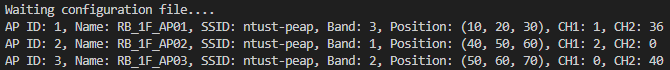

# Using Netconf to Configure AP (Netconf Adapter)

#### Outline:
- [Using Netconf to Configure AP (Netconf Adapter)](#using-netconf-to-configure-ap-netconf-adapter)
      - [Outline:](#outline)
  - [Netconf、YANG and Sysrepo](#netconfyang-and-sysrepo)
      - [Netconf, YANG and Sysrepo](#netconf-yang-and-sysrepo)
  - [Install Netconf](#install-netconf)
      - [Netconf Installation Guide](#netconf-installation-guide)
  - [Netconf Server Setting](#netconf-server-setting)
  - [Configuration File](#configuration-file)
    - [Parameters](#parameters)
      - [Wifi Parameters](#wifi-parameters)
      - [After Mapping](#after-mapping)
    - [YANG](#yang)
      - [YANG List](#yang-list)
      - [Install YANG module](#install-yang-module)
    - [AP configuration File](#ap-configuration-file)
  - [Get data from sysrepo](#get-data-from-sysrepo)
    - [Create session and subscribe module change](#create-session-and-subscribe-module-change)
    - [`module_change` callback function](#module_change-callback-function)
  - [Result](#result)
    - [Steps:](#steps)
      - [Step 1: Install netconf if you haven't installed it yet](#step-1-install-netconf-if-you-havent-installed-it-yet)
      - [Step 2: add a netconf user](#step-2-add-a-netconf-user)
      - [Step 3: Install all of YANG modules and configure the NACM authorization](#step-3-install-all-of-yang-modules-and-configure-the-nacm-authorization)
      - [Step 4: Start netconf server](#step-4-start-netconf-server)
      - [Step 5: exacut the ns-3 wifi program](#step-5-exacut-the-ns-3-wifi-program)
      - [Step 6: connect to netconf server in SMO](#step-6-connect-to-netconf-server-in-smo)
      - [Step 7: send AP configuration file](#step-7-send-ap-configuration-file)
      - [ns-3 receive](#ns-3-receive)
  - [Appendix: Scripts](#appendix-scripts)
    - [Add netconf user script](#add-netconf-user-script)
    - [Install netconf script](#install-netconf-script)
    - [load yang script](#load-yang-script)
    - [netopeer-server script](#netopeer-server-script)


## Netconf、YANG and Sysrepo
#### [Netconf, YANG and Sysrepo](/8NiD-jriQDiKiQZs6pvPDw)
* This note will show what is Netconf、YANG and sysrepp and also their relationship.


## Install Netconf
#### [Netconf Installation Guide](/3t5all9ERRqIUSeGm96W0g)
* I want to use SMO send configuration file to ns-3 through O1.
* To achieve this, I need to use NETCONF server and datastore, such as sysrepo and Netopeer2.
* This guide is the detailed steps to install the Netopeer2 and other libraries.


## Netconf Server Setting
Use below command to setting the server.
```shell=
sudo ./yang_config.sh
```

## Configuration File
### Parameters

#### Wifi Parameters
| Parameters     | Data Types  | description                                                                  |
|:-------------- |:----------- |:---------------------------------------------------------------------------- |
| AP ID          | `uint32`    | The configured id of the WiFi Access Point.                                                                             |
| AP name        | `string`    | The configured name of the WiFi Access Point. (RB_1F_AP01)                   |
| SSID           | `string`    | The network name that identifies the WiFi network.                           |
| Radio band     | `string`    | AP frequency band, 2.4GHz, 5GHz.                                             |
| Channel number | `uint32`    | The frequency channel on which the AP operates (e.g., 1, 6, 11 for 2.4GHz).  |
| Position.X     | `decimal64` | The physical coordinates of the AP in a 3D space, representing its location. |
| Position.Y     | `decimal64` | The physical coordinates of the AP in a 3D space, representing its location. |
| Position.Z     | `decimal64` | The physical coordinates of the AP in a 3D space, representing its location. |

#### After Mapping
| Aruba        | ns-3         | O1              |
|:------------ |:------------ |:--------------- |
| `ap_id`      | `ap_id`      | `gNBDUId`       |
| `ap_name`    | `ap_name`    | `gNBDUName`     |
| `ssid`       | `SSID`       | `id`            |
| `radio_band` | `radio_band` | X               |
| `channel`    | `channel`    | `arfcnDL`       |
| X            | `Position.X` | `siteLatitude`  |
| X            | `Position.Y` | `siteLongitude` |
| X            | `Position.Z` | `siteAltitude`  |


### YANG
Download 3gpp 5g YANG models from 3gpp.

#### YANG List


| Name                                     |
|:---------------------------------------- |
| `_3gpp-common-yang-types.yang`           |
| `_3gpp-common-top.yang`                  |
| `_3gpp-common-measurements.yang`         |
| `_3gpp-common-trace.yang`                |
| `_3gpp-common-managed-function.yang`     |
| `_3gpp-common-subscription-control.yang` |
| `_3gpp-common-fm.yang`                   |
| `_3gpp-common-managed-element.yang`      |
| `_3gpp-5g-common-yang-types.yang`        |
| `_3gpp-nr-nrm-rrmpolicy.yang`            |
| `_3gpp-nr-nrm-gnbdufunction.yang`        |
| `_3gpp-nr-nrm-nrcelldu.yang`             |


#### Install YANG module
We can use script to download and install the YANG models.
[load_yang.sh](#load-yang-script)

```shell=
sudo ./load_yang.sh
```


### AP configuration File
After we defind parameters and load YANG models, we can accroding those to create the configuration file.
```xml=
<ManagedElement xmlns="urn:3gpp:sa5:_3gpp-common-managed-element">
  <id>ManagedElement=ns3-wifi-dt,ntust-wifi-dt-ap-0006</id>
  <attributes>
    <priorityLabel>1</priorityLabel>
  </attributes>
  <GNBDUFunction xmlns="urn:3gpp:sa5:_3gpp-nr-nrm-gnbdufunction">
    <id>ManagedElement=ns3-wifi-dt,ntust-peap,AP-1,band=3</id>
    <attributes>
      <priorityLabel>1</priorityLabel>
      <gNBId>0</gNBId>
      <gNBIdLength>32</gNBIdLength>
      <gNBDUId>1</gNBDUId>
      <gNBDUName>RB_1F_AP01</gNBDUName>
      <peeParametersList>
        <idx>1</idx>
        <siteLatitude>10.0</siteLatitude>
        <siteLongitude>20.0</siteLongitude>
        <siteAltitude>30.0</siteAltitude>
      </peeParametersList> 
    </attributes>
    <NRCellDU xmlns="urn:3gpp:sa5:_3gpp-nr-nrm-nrcelldu">
      <id>ManagedElement=ns3-wifi-dt,ntust-peap,AP-1,2.4G</id>
      <attributes>
        <priorityLabel>1</priorityLabel>
        <arfcnDL>1</arfcnDL>
      </attributes>
    </NRCellDU>
    <NRCellDU xmlns="urn:3gpp:sa5:_3gpp-nr-nrm-nrcelldu">
      <id>ManagedElement=ns3-wifi-dt,ntust-peap,AP-1,5G</id>
      <attributes>
        <priorityLabel>1</priorityLabel>
        <arfcnDL>36</arfcnDL>
      </attributes>
    </NRCellDU>
  </GNBDUFunction>
  <GNBDUFunction xmlns="urn:3gpp:sa5:_3gpp-nr-nrm-gnbdufunction">
    <id>ManagedElement=ns3-wifi-dt,ntust-peap,AP-2,band=1</id>
    <attributes>
      <priorityLabel>1</priorityLabel>
      <gNBId>0</gNBId>
      <gNBIdLength>32</gNBIdLength>
      <gNBDUId>2</gNBDUId>
      <gNBDUName>RB_1F_AP02</gNBDUName>
      <peeParametersList>
        <idx>2</idx>
        <siteLatitude>40.0</siteLatitude>
        <siteLongitude>50.0</siteLongitude>
        <siteAltitude>60.0</siteAltitude>
      </peeParametersList> 
    </attributes>
    <NRCellDU xmlns="urn:3gpp:sa5:_3gpp-nr-nrm-nrcelldu">
      <id>ManagedElement=ns3-wifi-dt,ntust-peap,AP-2,2.4G</id>
      <attributes>
        <priorityLabel>1</priorityLabel>
        <arfcnDL>2</arfcnDL>
      </attributes>
    </NRCellDU>
  </GNBDUFunction>
  <GNBDUFunction xmlns="urn:3gpp:sa5:_3gpp-nr-nrm-gnbdufunction">
    <id>ManagedElement=ns3-wifi-dt,ntust-peap,AP-3,band=2</id>
    <attributes>
      <priorityLabel>1</priorityLabel>
      <gNBId>0</gNBId>
      <gNBIdLength>32</gNBIdLength>
      <gNBDUId>3</gNBDUId>
      <gNBDUName>RB_1F_AP03</gNBDUName>
      <peeParametersList>
        <idx>3</idx>
        <siteLatitude>50.0</siteLatitude>
        <siteLongitude>60.0</siteLongitude>
        <siteAltitude>70.0</siteAltitude>
      </peeParametersList> 
    </attributes>
    <NRCellDU xmlns="urn:3gpp:sa5:_3gpp-nr-nrm-nrcelldu">
      <id>ManagedElement=ns3-wifi-dt,ntust-peap,AP-3,5G</id>
      <attributes>
        <priorityLabel>1</priorityLabel>
        <arfcnDL>40</arfcnDL>
      </attributes>
    </NRCellDU>
  </GNBDUFunction>
</ManagedElement>
```

## Get data from sysrepo

### [Create session and subscribe module change](https://github.com/bmw-ece-ntust/wifi-ns3/blob/will-daily/src/ns-3_files/scratch/wifi-dt-O1-v3gpp.cc#L377)
```cpp=
// Connect to sysrepo
sysrepo::S_Connection conn(new sysrepo::Connection());

// Start a session
sysrepo::S_Session session(new sysrepo::Session(conn));

// Subscribe to changes
sysrepo::S_Subscribe subscribe(new sysrepo::Subscribe(session));

// Create and set up the callback
sysrepo::S_Callback wifi_ap_config_cb(new APConfigCb());
subscribe->module_change_subscribe("_3gpp-common-managed-element", wifi_ap_config_cb);
```


### [`module_change` callback function](https://github.com/bmw-ece-ntust/wifi-ns3/blob/will-daily/src/ns-3_files/scratch/wifi-dt-O1-v3gpp.cc#L243)
```cpp=
int module_change(sysrepo::S_Session session, const char *module_name, const char *xpath, sr_event_t event, uint32_t request_id, void *private_data)
        {
            char change_path[XPATH_MAX_LEN];

            if (event == SR_EV_CHANGE)
            {
                try
                {
                    snprintf(change_path, XPATH_MAX_LEN, "/%s:*//.", module_name);
                    auto it = session->get_changes_iter(change_path);

                    std::map<int, AccessPointManager::AccessPoint> tempAPMap;

                    while (auto change = session->get_change_next(it)) {
                        if(nullptr != change->new_val())
                        {
                            std::string val = change->new_val()->val_to_string();
                            std::string parent, leaf;

                            getLeafInfo(change->new_val()->to_string(), parent, leaf);
                            //std::cout << "parent: " << parent<< std::endl;
                            //std::cout << "leaf: " << leaf<< std::endl;
                            //std::cout << "val: " << val<< std::endl;
                            //std::cout << "-------------------------------------------------------------------------"<< std::endl;

                            std::string ssid;
                            int apId, band;

                            if (parent.find("GNBDUFunction") != std::string::npos && leaf == "id"){
                                std::regex regex_pattern("(.*?),AP-(\\d+),band=(\\d+)");
                                std::smatch match;

                                if (std::regex_match(val, match, regex_pattern)) {
                                    ssid = match[1];
                                    apId = std::stoi(match[2]);
                                    band = std::stoi(match[3]);
                                    tempAPMap[apId].ap_id = apId;
                                    tempAPMap[apId].ssid = ssid;
                                    tempAPMap[apId].band = band;
                                }
                            }
                            else if (parent == "attributes"){
                                if (leaf == "gNBDUName"){
                                    tempAPMap[apId].ap_name = val;
                                }
                                else if (leaf == "arfcnDL"){
                                    if (tempAPMap[apId].band == 1){
                                        tempAPMap[apId].channel_band1 = std::stoi(val);
                                        tempAPMap[apId].channel_band2 = 0;
                                    }
                                    else if (tempAPMap[apId].band == 2){
                                        tempAPMap[apId].channel_band1 = 0;
                                        tempAPMap[apId].channel_band2 = std::stoi(val);
                                    }
                                    else if (tempAPMap[apId].band == 3){
                                        tempAPMap[apId].channel_band1 = std::stoi(val);
                                        band ++;
                                    }
                                    else if (tempAPMap[apId].band == 4){
                                        tempAPMap[apId].channel_band2 = std::stoi(val);
                                    }
                                }
                            }
                            else if (leaf == "siteLatitude"){
                                tempAPMap[apId].location.x = std::stod(val);
                            }
                            else if(leaf == "siteLongitude"){
                                tempAPMap[apId].location.y = std::stod(val);
                            }
                            else if (leaf == "siteAltitude"){
                                tempAPMap[apId].location.z = std::stod(val);
                            }
                        }
                    }

                    for (const auto& [key, ap] : tempAPMap) 
                    {
                        accessPointManager.AddAccessPoint(ap);
                    }
                    accessPointManager.PrintAll();
                }
                catch (const std::exception &e)
                {
                    std::cerr << "ap module change callback error: " << e.what() << std::endl;
                    return SR_ERR_CALLBACK_FAILED;
                }
            }
            return SR_ERR_OK;
        }
```


## Result

### Steps:
#### Step 1: Install netconf if you haven't installed it yet
[Install netconf script](#Install-netconf-script)
```shell=
sudo ./install_netconf.sh
```

#### Step 2: add a netconf user
[Add netconf user script](#Add-netconf-user-script)
```shell=
sudo ./add_netconf_user.sh
```


#### Step 3: Install all of YANG modules and configure the NACM authorization
[load yang script](#load-yang-script)
```shell=
sudo ./load_yang.sh
```


#### Step 4: Start netconf server
[netopeer-server script](#netopeer-server-script)
```shell=
sudo ./netopeer-server.sh start
```


You can check the log by using ```cat /netopeer2-server.log```


#### Step 5: exacut the ns-3 wifi program
```shell=
cd ns-3-allinone/ns-3.42/
./ns3 run scratch/wifi_DT.cc
```


#### Step 6: connect to netconf server in SMO
Notice: In SMO terminal
```shell=
netopeer2-cli
connect --host <ip> --port <port> --login <username>
```


#### Step 7: send AP configuration file
Notice: In SMO terminal
You can modify the xml file by yourself.
```shell=
edit-config --target running --config=ap-config.xml
```

#### ns-3 receive



## Appendix: Scripts

### Add netconf user script
```shell=
# This script will add new netconf user
#!/bin/bash

adduser --system netconf && \
   echo "<username>:<password>" | chpasswd

mkdir -p /home/netconf/.ssh && \
   ssh-keygen -A && \
   ssh-keygen -t dsa -P '' -f /home/netconf/.ssh/id_dsa && \
   cat /home/netconf/.ssh/id_dsa.pub > /home/netconf/.ssh/authorized_keys


```

### Install netconf script
```shell=
#!/bin/bash

# Pre-requisite script for installing Netconf Libraries
# and compiling the O1 module

#variable declaration
CURRENT_PATH=`pwd`
HOME="$CURRENT_PATH"
NETCONF_PATH="$HOME/netconf"

INSTALL="netconf"
CLEANUP="no"
SUDO="sudo"

#logging functions
log_error(){
   echo ""
   echo -e "\e[1;31m *****  $1  ***** \e[0m"
   echo ""
}
log_warning() {
   echo ""
   echo -e "\e[1;35m *****  $1  ***** \e[0m"
   echo ""
}
log_success() {   
   echo ""
   echo -e "\e[1;32m *****  $1  ***** \e[0m"
   echo ""
}
log()         {
   echo -e "$1 "
}

#install pre-requisite packages

prerequisite_netconf() {
      $SUDO apt-get update

      $SUDO apt-get install -y jq \
      cmake \
      build-essential \
      supervisor \
      libpcre3-dev \
      pkg-config \
      libavl-dev \
      libev-dev \
      libprotobuf-c-dev \
      protobuf-c-compiler \
      libssh-dev \
      libssl-dev \
      swig \
      iputils-ping \
      python-dev
}

#check return value
check_ret() {

   if [ $2 -eq 0 ]; then
      log_success " $1 INSTALLATION DONE"
   else
      log_error " $1 INSTALLATION FAILED "
   fi
}


#install netconf  libraries
install_netconf_lib() {

   mkdir -p $NETCONF_PATH

   #1. libssh
   cd $NETCONF_PATH && \
      git clone -c http.sslverify=false --depth 1 https://github.com/libssh/libssh-mirror.git && \
      mv libssh-mirror libssh && \
      cd libssh; mkdir build; cd build && \
      cmake .. && \
      make && \
      $SUDO make install

   check_ret "LIBSSH" "$?"

   #cJSON
   cd $NETCONF_PATH && \
      git clone --single-branch --branch v1.7.14 https://github.com/DaveGamble/cJSON.git && \
      cd cJSON && \
      mkdir build && cd build && \
      cmake .. -DENABLE_CJSON_UTILS=On -DENABLE_CJSON_TEST=Off && \
      make -j4 && \
      $SUDO make install && \
      $SUDO ldconfig
   check_ret "LIBJSON" "$?"

   #CURL
   cd $NETCONF_PATH && \
      git clone --single-branch --branch curl-7_72_0 https://github.com/curl/curl.git &&\
      cd curl && \
      mkdir build && cd build && \
      cmake -DBUILD_TESTING=OFF .. && \
      make -j4 && \
      $SUDO make install && \
      $SUDO ldconfig
   check_ret "LIBCURL" "$?"

   # libyang
   cd $NETCONF_PATH && \
      git clone -b v1.0.184 --depth 1 https://github.com/CESNET/libyang.git && \
      cd libyang && mkdir build && cd build && \
      cmake -DGEN_LANGUAGE_BINDINGS=ON -DGEN_PYTHON_BINDINGS=OFF \
            -DCMAKE_BUILD_TYPE:String="Debug" -DENABLE_BUILD_TESTS=OFF .. && \
      make -j2 && \
      $SUDO make install && \
      $SUDO ldconfig

   check_ret "LIBYANG" "$?"

   # sysrepo
   cd $NETCONF_PATH && \
      git clone -b v1.4.70 --depth 1  https://github.com/sysrepo/sysrepo.git && \
      cd sysrepo && sed -i -e 's/2000/30000/g;s/5000/30000/g' src/common.h.in && \
      mkdir build && cd build && \
      cmake -DGEN_LANGUAGE_BINDINGS=ON -DGEN_PYTHON_BINDINGS=OFF \
            -DCMAKE_BUILD_TYPE:String="Debug" -DENABLE_TESTS=OFF \
	    -DREPOSITORY_LOC:PATH=/etc/sysrepo .. && \
      make -j2 && \
      $SUDO make install && $SUDO make sr_clean && \
      $SUDO ldconfig

   check_ret "SYSREPO" "$?"

   # libnetconf2
   cd $NETCONF_PATH && \
      git clone -b v1.1.36 --depth 1 https://github.com/CESNET/libnetconf2.git && \
      cd libnetconf2 && mkdir build && cd build && \
      cmake -DCMAKE_BUILD_TYPE:String="Debug" -DENABLE_BUILD_TESTS=OFF .. && \
      make -j2 && \
      $SUDO make install && \
      $SUDO ldconfig

   check_ret "LIBNETCONF2" "$?"

   # netopeer2
   cd $NETCONF_PATH && \
      git clone -b v1.1.53 --depth 1 https://github.com/CESNET/Netopeer2.git && \
      cd Netopeer2 && mkdir build && cd build && \
      cmake -DCMAKE_BUILD_TYPE:String="Debug" -DNP2SRV_DATA_CHANGE_TIMEOUT=30000 \
            -DNP2SRV_DATA_CHANGE_WAIT=OFF .. && \
      make -j2 && \
      $SUDO make install -d
   check_ret "NETOPEER2" "$?"

}

prerequisite_netconf

install_netconf_lib

log_success " SCRIPT COMPLETED"
exit

#**********************************************************************
#    End of file
#**********************************************************************

```

### load yang script
```shell=
#!/bin/bash

#initialize globle variables
CURRENT_DIR=$PWD
ROOT_DIR=$CURRENT_DIR/../../

#list of 3gpp yang models
declare -a YANG_MODEL_3GPP=( "_3gpp-common-yang-types.yang"
                        "_3gpp-common-top.yang"
                        "_3gpp-common-measurements.yang"
                        "_3gpp-common-trace.yang"
                        "_3gpp-common-managed-function.yang"
                        "_3gpp-common-subscription-control.yang"
                        "_3gpp-common-fm.yang"
                        "_3gpp-common-managed-element.yang"
                        "_3gpp-5g-common-yang-types.yang"
                        "_3gpp-nr-nrm-rrmpolicy.yang"
                        "_3gpp-nr-nrm-gnbdufunction.yang"
                        "_3gpp-nr-nrm-nrcelldu.yang")


#install 3GPP and ORAN yang modules
installYang()
{
   echo "### install yang modules ###"
   #install 3GPP yang modules
   for yang in "${YANG_MODEL_3GPP[@]}"
   do
      sysrepoctl -i      $ROOT_DIR/build/yang_files/$yang
   done
}

installYang
```

### netopeer-server script
```shell=
#!/bin/bash

if [ "$1" == "" ]
then
   echo Usage : netopeer.sh [start] [stop]
fi

if [ "$1" == "start" ]
then
   netopeer2-server -d -v2 > /netopeer2-server.log 2>&1 &
fi

if [ "$1" == "stop" ]
then
   kill -9 `pidof netopeer2-server`
fi

```